# Tempo system architecture

This document describes the current implementation of Tempo. It is an operational and code-level
reference: what starts, how work is selected, what becomes durable, which process executes each
action, and how an issue reaches a pull request, merge, human handoff, retry, or safety stop.

## Contents

- [System boundaries](#system-boundaries)
- [Process and component model](#process-and-component-model)
- [Startup and shutdown](#startup-and-shutdown)
- [Workflow and configuration](#workflow-and-configuration)
- [Polling, eligibility, and scheduling](#polling-eligibility-and-scheduling)
- [Durable data model](#durable-data-model)
- [Issue workspace lifecycle](#issue-workspace-lifecycle)
- [Implementation lifecycle](#implementation-lifecycle)
- [Codex app-server integration](#codex-app-server-integration)
- [Validation and publication gate](#validation-and-publication-gate)
- [Independent review and merge policy](#independent-review-and-merge-policy)
- [Retries, leases, checkpoints, and recovery](#retries-leases-checkpoints-and-recovery)
- [Operator control and HTTP API](#operator-control-and-http-api)
- [Authentication and security boundaries](#authentication-and-security-boundaries)
- [Docker Compose topology](#docker-compose-topology)
- [Module map](#module-map)
- [Environment variables](#environment-variables)
- [Known implementation limits](#known-implementation-limits)

## System boundaries

Tempo owns orchestration state. The issue tracker remains authoritative for whether an issue is
open, closed, labeled for dispatch, and still routable. The issue workspace is authoritative for
the current code. The database is authoritative for accepted runs, leases, retries, checkpoints,
approvals, operator actions, and completed/safety-stopped dispositions.

Tempo does not contain a hard-coded project build system. The agent discovers build, launch, and
test commands from the target repository and submits them to Tempo's validation tool.

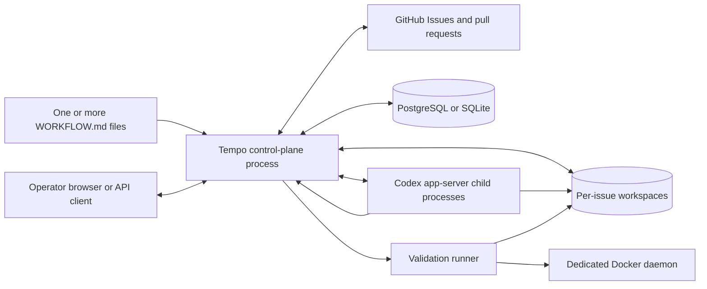

The arrows from Codex to Tempo represent dynamic tool calls. GitHub credentials stay in the Tempo
process; the Codex child receives a host-provided `github_api` tool instead of the token itself.

## Process and component model

The `tempo` console script enters `tempo.cli:main`.

1. Django is initialized.
2. CLI arguments resolve one or more workflow paths.
3. Database migrations run.
4. An optional initial superuser is created.
5. A `ControlPlane` creates one `Orchestrator` per workflow.
6. Every orchestrator initializes its tracker, workspace manager, persistence store, durable
   summaries, and pending runs.
7. Uvicorn serves the Django ASGI application unless `--no-http` is set.

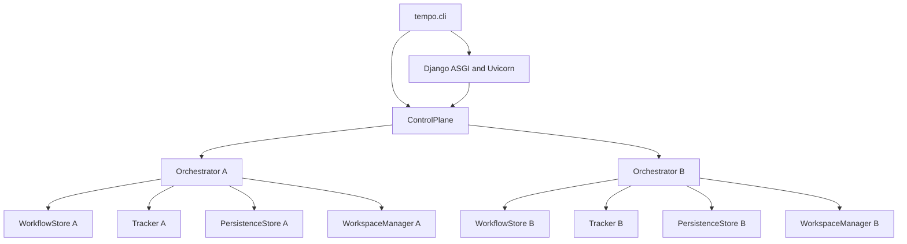

Orchestrators share a process and database, but their live queues, limits, trackers, workflow
definitions, and workspace managers are separate. Each workflow must have a unique normalized
`project.organization` and `project.slug` pair. The control plane rejects duplicates after
startup.

The in-process sets and dictionaries (`running`, `claimed`, `retries`, `completed`, and
`safety_blocked`) are scheduling caches. Durable records are reloaded on startup and reconciled on
every tick.

## Startup and shutdown

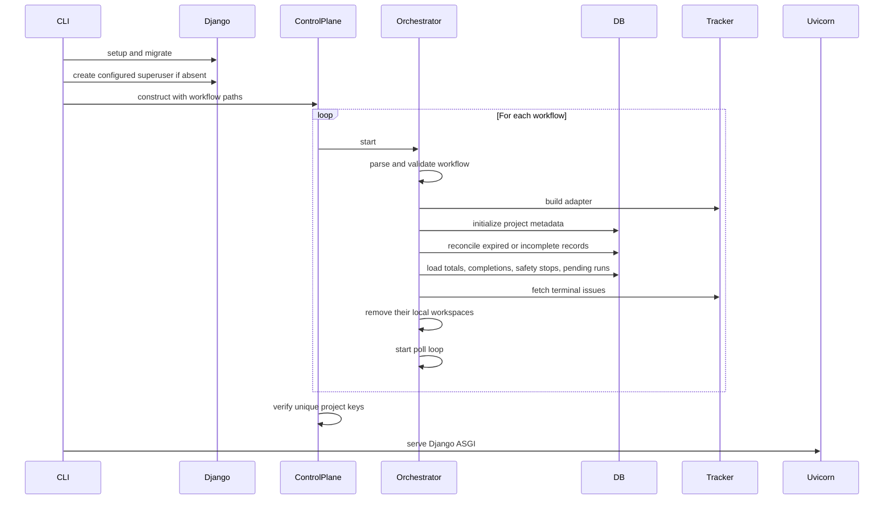

Startup fails if a workflow cannot be read or validated, a required environment reference is
empty, tracker setup fails, database initialization fails, or two workflows use the same project
key. If a later orchestrator fails to start, already-started orchestrators are stopped.

On shutdown, poll loops and active worker tasks are cancelled, tracker clients are closed, and
Uvicorn exits. A cancelled active run is made recoverable by lease reconciliation on the next
startup.

## Workflow and configuration

### File format

A workflow contains optional YAML front matter delimited by `---` and a Markdown/Jinja body. In
practice, a tracker is required by the typed configuration, so operational workflows need front
matter.

The prompt is rendered with Jinja `StrictUndefined`. Only these top-level values are supplied:

- `issue`: the normalized issue as a dictionary
- `attempt`: the current retry/continuation attempt, or `None` on the first run

An unknown variable is a prompt-rendering error. An empty prompt uses the built-in default prompt.

### Environment references and paths

A value shaped exactly like `$NAME` is resolved from the environment for:

- `workspace.root`
- `tracker.provider.token`
- `tracker.provider.api_key`
- `tracker.provider.review_token`

This is whole-value resolution, not shell interpolation: `/path/$NAME` is not expanded.
`workspace.root`, primary `token`, and `api_key` references must resolve to non-empty values. An
empty review token is allowed. `~` is expanded. A relative workspace root is resolved relative to
the workflow file, not the current shell directory.

### Configuration reference

| Section | Setting | Default or rule |
| --- | --- | --- |
| `project` | `organization` | `default`; normalized to lowercase with spaces/underscores changed to `-` |
| `project` | `slug` | `default`; same normalization |
| `project` | `name` | `Default project` |
| `project` | `environment` | `development`; normalized like project identifiers |
| `project` | `max_concurrent_runs` | `3`, positive |
| `project` | `environment_max_concurrent_runs` | `3`, positive |
| `tracker` | `kind` | Required; `github` or `memory` |
| `tracker` | `provider` | Provider-specific mapping; GitHub requires `repo: owner/name` |
| `tracker` | `required_labels` | `[]`; lowercased and deduplicated |
| `tracker` | `active_states` | Required non-empty list |
| `tracker` | `terminal_states` | Required non-empty list; may not overlap active states |
| `polling` | `interval_ms` | `30000`, positive |
| `workspace` | `root` | OS temp directory plus `tempo_workspaces` if omitted |
| `hooks` | `after_create` | Optional fatal shell hook, only for a newly created directory |
| `hooks` | `before_run` | Optional fatal shell hook before every worker attempt |
| `hooks` | `after_run` | Optional non-fatal shell hook after every worker attempt |
| `hooks` | `before_remove` | Optional non-fatal shell hook before terminal cleanup |
| `hooks` | `timeout_ms` | `60000`, applied separately to each hook |
| `agent` | `max_concurrent_agents` | `10`, positive |
| `agent` | `max_turns` | `20`, positive |
| `agent` | `max_tokens_per_run` | `1000000`, positive, enforced per attempt |
| `agent` | `max_retries` | `2`, from 0 through 20 |
| `agent` | `max_retry_backoff_ms` | `300000`, positive |
| `agent` | `max_concurrent_agents_by_state` | `{}`; invalid/non-positive entries are ignored |
| `validation` | `enabled` | `true` |
| `validation` | `runner_url` | `null`; `TEMPO_VALIDATION_RUNNER_URL` is the fallback |
| `validation` | `command_timeout_ms` | `1800000` |
| `validation` | `cleanup_timeout_ms` | `120000` |
| `validation` | `max_commands` | `12`, maximum 50 |
| `validation` | `max_attempts_per_run` | `5`, maximum 50 |
| `validation` | `max_output_chars` | `40000`, tail retained per command |
| `review` | `enabled` | `false` |
| `review` | `max_turns` | `3`, maximum 20 |
| `review` | `auto_merge` | `false` |
| `review` | `merge_method` | `squash`; also supports `merge` and `rebase` |
| `review` | `reviewers` | `[]`; GitHub usernames for human handoff |
| `review` | `team_reviewers` | `[]`; GitHub teams for human handoff |
| `review` | `prompt` | Built-in independent-review instructions |
| `codex` | `command` | `codex app-server` |
| `codex` | `approval_policy` | Reject sandbox/rule/MCP escalation requests by default |
| `codex` | `thread_sandbox` | `workspace-write` |
| `codex` | `turn_sandbox_policy` | Workspace write to the issue directory with network disabled |
| `codex` | `turn_timeout_ms` | `3600000` |
| `codex` | `read_timeout_ms` | `5000` |
| `codex` | `stall_timeout_ms` | `300000`; `0` disables stall detection |

Pydantic ignores extra fields inside `tracker`; other models use Pydantic's default extra-field
behavior. GitHub state values are effectively `open` and `closed`, because the adapter only fetches
those API states.

### Dynamic reload

Each tick checks the workflow file's nanosecond modification time.

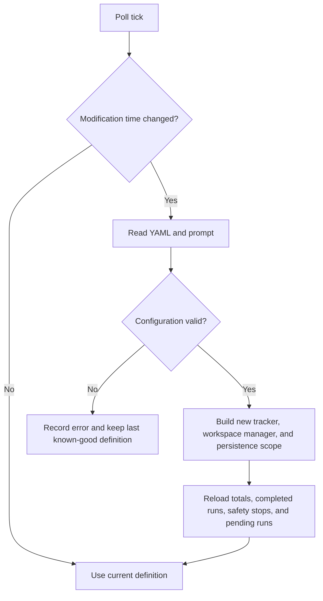

The prior tracker is retained until active runs finish, because those workers still reference it.
Once no runs remain, retired tracker clients are closed.

## Polling, eligibility, and scheduling

Every orchestrator has an asynchronous tick loop. The normal delay is `polling.interval_ms`; an
earlier retry deadline shortens it. Refresh requests set an event that wakes the loop.

A tick performs these steps in order:

1. Reload a changed workflow if valid.
2. Reconcile expired database records and restore pending runs.
3. Detect stalled workers and reconcile all active issues with the tracker.
4. Process due retries.
5. Fetch issues in configured active states.
6. Sort candidates.
7. Durably enqueue and transactionally claim each eligible candidate before starting its task.

### Eligibility

An issue is dispatchable only when all of these are true:

- Its tracker ID is absent from `claimed`, `running`, `completed`, and `safety_blocked`.
- Its normalized state is active and not terminal.
- The adapter says `dispatchable=true`.
- Every configured required label is on the issue.
- A global, project, environment, and optional state-specific slot is available.

GitHub pull requests returned by the Issues API are filtered out. GitHub issues are normalized to
IDs such as external ID `42` and display identifier `GH-42`.

### Ordering and concurrency

Candidates sort by:

1. Priority 1 through 4; missing or other values become 5.
2. Creation time, oldest first.
3. Identifier, lexically.

The live global limit is the minimum of:

- `agent.max_concurrent_agents`
- `project.max_concurrent_runs`
- `project.environment_max_concurrent_runs`

A state-specific limit is then applied. The transactional database claim repeats project and
environment limit checks, which prevents two claimers from exceeding durable limits.

## Durable data model

PostgreSQL is used when `DATABASE_URL` is set. Otherwise Django uses SQLite at
`TEMPO_DATABASE_PATH` or `var/tempo.sqlite3`. Migrations run automatically whenever `tempo` starts.

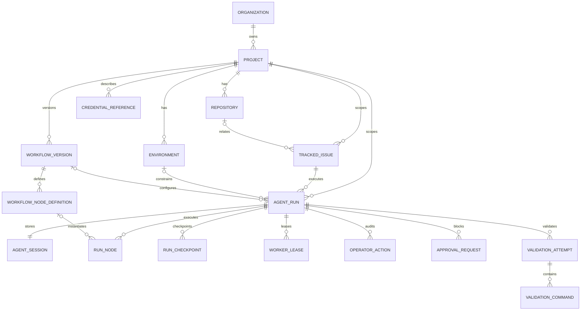

Important semantics:

- `Organization`, `Project`, `Environment`, and `Repository` are upserted from the active workflow.
- A `WorkflowVersion` is keyed by the workflow file's SHA-256 checksum. A changed checksum creates
  the next version.
- `CredentialReference` stores metadata only and is not populated from environment secrets by the
  current startup path.
- `TrackedIssue` is unique by project, tracker kind, and external ID.
- `AgentRun.idempotency_key` is based on project, tracker, and issue, preventing redispatch after a
  terminal run.
- `RunNode` stores each graph node's status, output, provider session/thread identifiers,
  attempt-level usage, and cumulative thread usage. That per-node state is the source for graph
  recovery.
- `AgentSession` remains a one-to-one run summary for compatibility and run-level telemetry; it
  represents the most recently active node or review thread rather than the complete session
  history.
- `RunCheckpoint` records selected non-delta events with a content-derived idempotency key.
- `WorkerLease` records 30-second claims and their heartbeats/releases.
- Validation attempts and individual commands retain status, exit code, output, timing, cleanup
  flag, and the accepted workspace fingerprint.

Run statuses are `queued`, `running`, `paused`, `waiting_approval`, `retry_scheduled`, `succeeded`,
`failed`, and `cancelled`. The more detailed `phase` string describes the current execution step.

## Issue workspace lifecycle

Workspace directories are derived from the issue identifier. Characters outside
`A-Z`, `a-z`, `0-9`, `.`, `_`, and `-` are replaced; when replacement occurs, a 16-character
SHA-256 suffix prevents sanitized-name collisions. Empty, `.` and `..` identifiers become a
hash-based key.

Every path is resolved and checked to remain beneath the configured root. Existing paths must be
directories, and symlinks may not escape the canonical root.

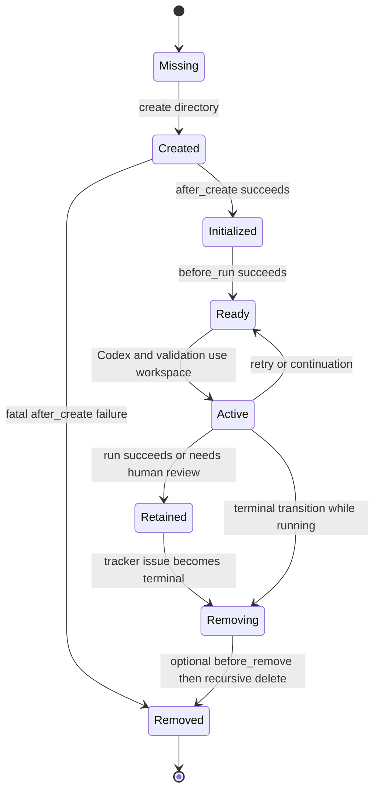

`after_create` and `before_run` failures are fatal. `after_run` and `before_remove` failures or
timeouts are logged and ignored. Workspaces are not removed merely because a run succeeds; they
are swept for terminal issues at startup and removed on observed terminal transitions.

## Implementation lifecycle

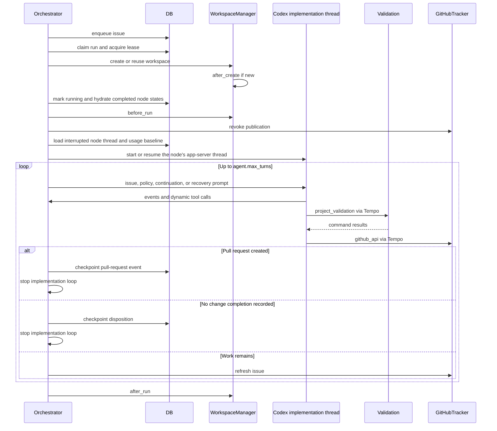

Before each worker, publication is revoked. If validation is disabled, publication is immediately
authorized. The first prompt is the rendered workflow plus Tempo's validation/publication policy.
Later turns receive a validation continuation if validation has not passed, otherwise a general
continuation. Operator feedback is prepended once and then cleared durably.

The loop stops when:

- A pull request has been discovered from a successful GitHub tool response.
- `tempo_complete` records a valid no-change disposition.
- The issue disappears, leaves an active state, or loses required routing labels.
- The configured turn count is exhausted.
- A timeout, approval rejection, tracker error, safety limit, or other exception ends the worker.

Ending without a pull request or no-change disposition is an error. Exhausting turns before
validation passes is also an error when validation is enabled.

## Codex app-server integration

Tempo launches `codex.command` through `bash -lc` in the issue workspace and communicates over
newline-delimited JSON on stdin/stdout.

The protocol sequence is:

1. `initialize`
2. `initialized`
3. `thread/start` or `thread/resume`
4. Repeated `turn/start`
5. Streamed events, server requests, and `turn/completed`

If `thread/resume` fails, Tempo creates a fresh thread and sends an explicit recovery prompt
instructing the agent to reconstruct from workspace, Git history, tracker state, and checkpoints.

### Dynamic tools

| Tool | Available role | Purpose and restrictions |
| --- | --- | --- |
| `github_api` | Implementation and review | Calls the configured repository's GitHub REST API with the host-held token |
| `project_validation` | Both, when enabled | Runs an agent-supplied build/test sequence and records results |
| `tempo_complete` | Implementation only | Finishes a validated issue when no code change is required |
| `tempo_review` | Review only | Records `approve` or `human_review`; approval requires an unchanged validated workspace |

GitHub mutations must target `/repos/<configured-owner>/<configured-repo>/...`. Agent calls cannot
merge pull requests or directly mutate issue state/labels. A pull-request creation body receives
`Closes #<issue>` if it does not already contain it. Creation reuses an existing open pull request
with the same head branch.

### Events and live state

Codex messages are normalized into events. Public activity includes agent messages, command/tool
events, file changes, validation output, phases, and token/rate-limit telemetry. Private reasoning
text is deliberately omitted by `tempo.activity`.

Non-delta events are persisted. Selected completion-like events are also checkpointed. Each event
heartbeats the run. Token usage from resumed threads is normalized against the stored cumulative
baseline so a new attempt gets a fresh attempt-level budget.

## Validation and publication gate

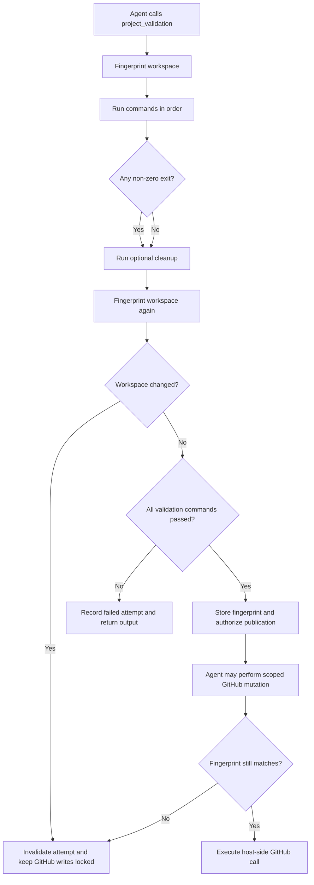

Fingerprinting hashes each Git-tracked and non-ignored untracked file path and its bytes. If Git
cannot list files, Tempo scans non-`.git` files. Symlinks contribute their target. Validation
commands are therefore allowed to create ignored build products, but not to modify project files
included by the fingerprint.

Commands run with `bash -lc`, in order, and stop on the first non-zero exit. The optional cleanup
command always runs, even after failure. A timeout kills the whole process group and reports exit
code 124. Only the configured output tail is retained.

Local-mode validation removes known tracker secret variables, `OPENAI_API_KEY`,
`DJANGO_SECRET_KEY`, and `TEMPO_ADMIN_PASSWORD` from the child environment. Compose instead sends
commands to the validation service. That service shares only the workspace volume and Docker host;
it is not given the application credentials or Codex home.

The validation runner checks that requested workspaces resolve beneath its configured root and
accepts at most 1 MiB request bodies. `/run-stream` returns newline-delimited output events followed
by one result event.

## Independent review and merge policy

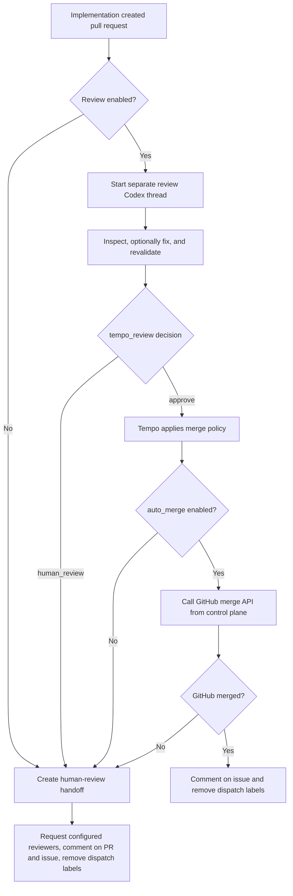

The review thread gets the configured review prompt plus fixed review policy. It has its own
thread, turn limit, and role-specific completion tool. It can change the branch, but any change
invalidates prior validation.

An `approve` decision requires:

- The caller is the review role.
- The summary is non-empty.
- Validation is disabled, or the current workspace exactly matches the last successful validation
  fingerprint.

After approval, the control plane—not Codex—calls GitHub:

- With `review_token`, it attempts a formal `APPROVE` review using the second identity.
- Without it, it writes an idempotent review comment.
- If automatic merge is disabled, it creates a human handoff despite the positive review.
- If GitHub rejects review, merge, permissions, checks, protection rules, or conflicts, it creates
  a human handoff.
- On merge, it comments on the source issue and removes all configured dispatch labels.

Human handoff requests configured users/teams when possible, posts idempotent PR and issue
comments, and removes dispatch labels so the issue is not redispatched. No-change completion also
comments on the issue and removes dispatch labels.

## Retries, leases, checkpoints, and recovery

### Lease behavior

A database claim locks the run row, checks availability and concurrency, then assigns a unique
lease token for 30 seconds. The worker heartbeats every 10 seconds and extends the lease. Codex
events also heartbeat.

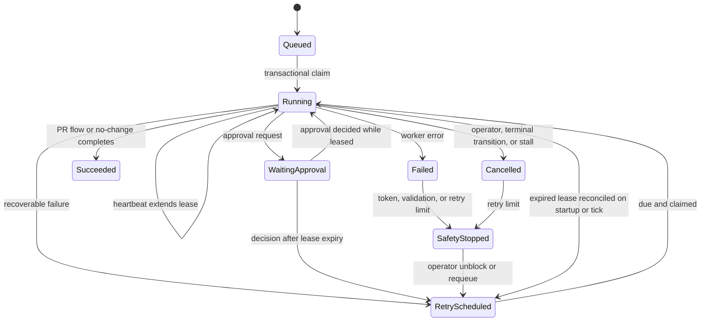

`SafetyStopped` is represented by phase `SafetyLimitReached`, not a distinct database status.

### Retry timing

Normal failure backoff is:

```text
min(10 seconds × 2^(attempt - 1), max_retry_backoff_ms)
```

The exponent is capped for arithmetic safety. A continuation after exhausting a set of successful
Codex turns uses a 1-second delay. If no execution slot is available when a retry is due, Tempo
reschedules it and increments the attempt.

Token budget excess and validation-attempt excess go directly to a safety stop. Unblocking starts
a new durable run attempt and a fresh attempt-level token budget, while reopening the interrupted
node's provider thread. Other failures retry until `max_retries` is exceeded. Stall detection
cancels a worker when its last Codex event or start time is older than `stall_timeout_ms`.

### Durable recovery

At startup and during ticks:

- A `running` run with no live lease or an expired lease becomes `retry_scheduled` with phase
  `Recovering`.
- An expired approval-wait lease is released while the run stays approval-blocked.
- An in-progress validation attached to a recovered run becomes `invalidated`.
- Queued/retry runs are restored into the live retry map.
- Completed issue IDs and `SafetyLimitReached` issue IDs repopulate their suppression sets.

On recovery, succeeded and skipped `RunNode` rows remain terminal and are not repeated. An
interrupted node is reset to pending, then its stored thread ID and cumulative token baseline are
passed to the configured runtime. Codex uses `thread/resume`; cumulative provider usage is reduced
by the stored baseline so only post-unblock tokens count against the fresh limit. If the provider
cannot resume, Tempo sends a recovery prompt that first inspects the retained workspace, Git
history, tracker, and checkpoints instead of replaying the original issue prompt.

`AgentSession` still supplies pull-request recovery context for the post-publication review path.
If a PR URL is absent, Tempo searches GitHub tool checkpoints and reconstructs it from a successful
PR response or numbered PR lookup.

## Operator control and HTTP API

The dashboard reads combined control-plane snapshots. Each orchestrator publishes a coalesced
notification whenever live state changes. The server-sent event endpoint sends a full initial
snapshot, then a new full snapshot per notification, with a comment keepalive every 15 seconds.

### Run actions

| Action | Behavior |
| --- | --- |
| `pause` | Cancels an active task, records a paused durable state |
| `cancel` | Cancels an active task or marks an inactive run cancelled and clears live suppression |
| `resume` | Requeues without incrementing the attempt |
| `retry` | Requeues and increments the attempt |
| `requeue` | Requeues without incrementing the attempt |
| `unblock` | Clears safety/completion suppression, increments the attempt, and requeues with node continuation state |
| `reprioritize` | Requires a positive integer and updates durable priority |
| `feedback` | Appends text that is prepended to the next Codex turn |

Run action requests accept `Idempotency-Key`. If omitted, the server generates one. Reusing a key
with a different run, action, or operator returns a conflict; an exact replay returns the stored
result.

### Approvals

When `codex.approval_policy` is not `never`, a GitHub mutation or Codex command/file approval can
create a durable approval request. The worker changes to `WaitingForApproval` and polls the
database until the decision is recorded. An operator can approve, reject, and optionally replace
the proposed argument object. If the original lease has expired, deciding the approval requeues
the run.

With approval policy `never`, command/file requests are approved for the session and GitHub
mutations bypass the operator inbox. Publication, repository-scope, issue-mutation, and merge
restrictions still apply.

### Route behavior

| Method | Route | Access | Implementation behavior |
| --- | --- | --- | --- |
| `GET` | `/healthz` | Public | `200 ok` when the control plane is installed, otherwise `503 starting` |
| `GET` | `/api/v1/state` | Public | Full combined live snapshot |
| `GET` | `/api/v1/events` | Public | Full-snapshot SSE stream |
| `GET` | `/api/v1/admin` | Public | Redacted workflow/tracker/policy/runtime snapshot |
| `GET` | `/api/v1/<identifier>` | Public | Returns one active/retry match; ambiguous multi-project identifiers return 404 |
| `POST` | `/api/v1/refresh` | Operator | Wakes every poll loop |
| `GET` | `/api/v1/control` | Operator | Up to 100 paused, approval-waiting, or safety-stopped runs |
| `POST` | `/api/v1/runs/<id>/<action>` | Operator | Applies and audits a supported action |
| `GET` | `/api/v1/approvals` | Operator | Pending approval requests |
| `POST` | `/api/v1/approvals/<id>/decision` | Operator | Approves/rejects and stores optional edited arguments/note |
| `POST` | `/api/v1/auth/login` | Public plus CSRF rules | Issues JWT in JSON and cookie |
| `POST` | `/api/v1/auth/logout` | Public plus CSRF rules | Clears cookie |
| `GET` | `/api/v1/auth/me` | Operator | Identity and authentication mechanism |

The `/`, `/ops/`, and `/ops/configuration/` HTML pages are publicly renderable. Authenticated
operator-only data and mutations are protected at their API endpoints.

## Authentication and security boundaries

### Operator identity

Tempo authenticates active Django users. Login issues an HS256 JWT:

- issuer: `tempo`
- audience: `tempo-operators`
- default lifetime: 8 hours
- browser cookie: `tempo_access`, HttpOnly, SameSite=Lax

API clients may use a Bearer token. Cookie-authenticated unsafe methods require Django's CSRF
checks. Bearer-authenticated requests are not subjected to cookie CSRF. Django session
authentication also remains available, especially for Admin.

### Credential flow

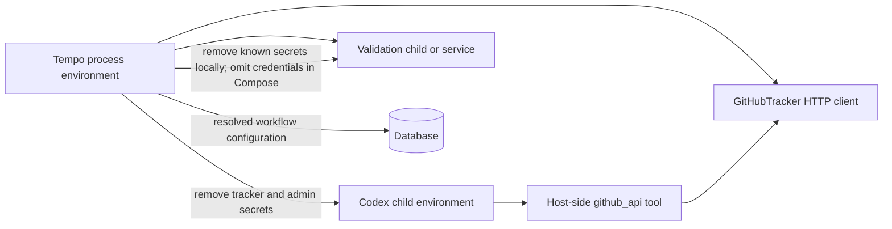

GitHub tokens, `DJANGO_SECRET_KEY`, and the bootstrap admin password are removed from Codex.
Validation removes those plus `OPENAI_API_KEY` in local mode. The Compose validation service is
not configured with them at all. `WorkflowVersion.config` currently stores the resolved effective
configuration, including resolved tracker credential values. The JSON configuration API omits
credentials and hook bodies, but database and Django Admin access can expose them and must be
treated as secret-bearing.

### Sandbox and execution caveats

- The default turn policy gives Codex write access to its issue workspace and no network access.
- `codex.approval_policy: never` auto-accepts Codex command/file approval requests.
- Hooks run directly in the Tempo container/process with its environment.
- Local validation is a subprocess of Tempo with a filtered environment, not a container sandbox.
- Compose validation uses a separate service but can access a privileged Docker-in-Docker daemon.
- Read-only dashboards and snapshot APIs are unauthenticated.
- Django currently accepts every host, has `DEBUG=false`, and assumes a reverse proxy supplies
  production TLS and network restrictions.

## Docker Compose topology

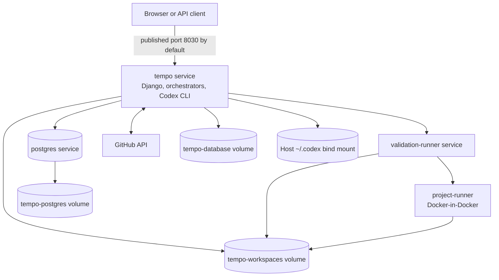

The `tempo` and `validation-runner` services use the same image. The image contains Python 3.12,
Pipenv-installed locked dependencies, Git, SSH, Node, Codex CLI, and Docker CLI. The application
runs as UID 10001; the Docker daemon is a separate privileged service.

The Tempo service bind-mounts the host's `~/.codex` read/write at `/home/tempo/.codex`, so Codex
uses the same ChatGPT authentication and state as the host CLI. The validation service does not
receive this mount.

`tempo` waits for PostgreSQL, validation, and Docker health checks. It mounts `WORKFLOW.md`
read-only and exposes the application on container port 8000. The validation service exposes only
its Compose network port 8787.

## Module map

| Path | Responsibility |
| --- | --- |
| `tempo/cli.py` | CLI parsing, migrations, optional superuser, control-plane/Uvicorn lifecycle |
| `tempo/control_plane.py` | Multi-workflow orchestration, combined snapshots, event fan-in, action routing |
| `tempo/orchestrator.py` | Poll loop, eligibility, claims, worker lifecycle, review, retry, live state |
| `tempo/workflow.py` | YAML/Markdown parsing, strict prompt rendering, last-known-good reload |
| `tempo/config.py` | Typed configuration, defaults, normalization, environment/path resolution |
| `tempo/workspace.py` | Safe workspace keys, containment, hooks, terminal cleanup |
| `tempo/codex.py` | App-server JSONL protocol, dynamic tools, approvals, fingerprints |
| `tempo/validation.py` | Validation tool schema and local/remote command execution |
| `tempo/validation_server.py` | Credential-free ASGI validation service and NDJSON streaming |
| `tempo/persistence.py` | Project metadata, durable queue, leases, sessions, checkpoints, history |
| `tempo/trackers/base.py` | Tracker interface |
| `tempo/trackers/github.py` | GitHub normalization, scoped tool calls, review/merge/handoff policy |
| `tempo/trackers/memory.py` | Deterministic test/development tracker |
| `tempo/activity.py` | Safe public activity extraction and delta coalescing |
| `tempo_web/models.py` | Django durable schema |
| `tempo_web/views.py` | HTML surfaces, auth, state/SSE APIs, approvals, operator actions |
| `tempo_web/jwt_auth.py` | JWT issuance/validation, cookie handling, auth and CSRF middleware |
| `tempo_web/admin.py` | Read-only runtime inspection in Django Admin |
| `tests/` | Deterministic unit/integration coverage with fake external processes |

## Environment variables

| Variable | Used by | Meaning |
| --- | --- | --- |
| `GITHUB_TOKEN` | Workflow/tracker | Primary GitHub API and repository identity |
| `GITHUB_REVIEW_TOKEN` | Tracker review policy | Optional distinct identity for formal approval |
| `OPENAI_API_KEY` | Codex CLI | API authentication; not passed to validation |
| `DJANGO_SECRET_KEY` | Django/JWT | Signing key; default is development-only |
| `DATABASE_URL` | Django | PostgreSQL URL; absent means SQLite |
| `TEMPO_DATABASE_PATH` | Django | SQLite path, default `var/tempo.sqlite3` |
| `TEMPO_WORKFLOW_PATH` | CLI | Default workflow path when no positional paths are given |
| `TEMPO_WORKSPACE_ROOT` | Workflow and runner | Workspace root; Compose sets `/data/workspaces` |
| `TEMPO_VALIDATION_RUNNER_URL` | Tempo validation | Remote runner base URL |
| `TEMPO_VALIDATION_RUNNER_PORT` | Runner | Runner listen port, default `8787` |
| `TEMPO_LOG_LEVEL` | Logging | Python/structlog level, default `INFO` |
| `TEMPO_TIME_ZONE` | Django | Display/application timezone, default `UTC` |
| `TEMPO_JWT_ACCESS_TTL_SECONDS` | Auth | JWT lifetime, minimum 60, default `28800` |
| `TEMPO_JWT_COOKIE_SECURE` | Auth | Marks access cookie Secure |
| `TEMPO_ADMIN_USERNAME` | Startup | Optional bootstrap superuser username |
| `TEMPO_ADMIN_PASSWORD` | Startup | Optional bootstrap superuser password |
| `TEMPO_ADMIN_EMAIL` | Startup | Optional bootstrap superuser email |
| `TEMPO_PORT` | Compose | Published host port, default `8030` |
| `TEMPO_POSTGRES_PASSWORD` | Compose | Local PostgreSQL password |
| `DOCKER_HOST` | Validation tooling | Compose points clients to the dedicated Docker daemon |

Pipenv automatically reads `.env` for local commands. Compose reads `.env` for substitution and
then explicitly passes selected variables to services.

## Known implementation limits

- The tracker abstraction exists, but only GitHub and an in-memory adapter are implemented.
- GitHub discovery polls `open` or `closed` issue lists; there is no webhook receiver.
- Worker tasks live in the control-plane process. Database leases provide safe recovery and basic
  multi-claimer protection, not an independently deployable worker pool.
- Workflow nodes and conditional edges are configurable, but execution still runs inside the
  control-plane process rather than a distributed workflow engine.
- `RunNode` preserves graph-agent thread state. The separate post-publication review still uses the
  run-level `AgentSession`, so its full session history is not independently modeled.
- `CredentialReference` exists as schema but has no secret-provider integration.
- Project/environment records and limits are configured from files; there is no UI onboarding or
  project-scoped authorization.
- Live snapshot events are process-local notifications. They are not a durable event stream.
- SQLite cannot provide PostgreSQL's intended concurrent claiming behavior and is for local use and
  deterministic tests.
- The app has no SSO, project RBAC, OpenTelemetry export, cost accounting, webhook intake, or
  generic MCP connector platform.
