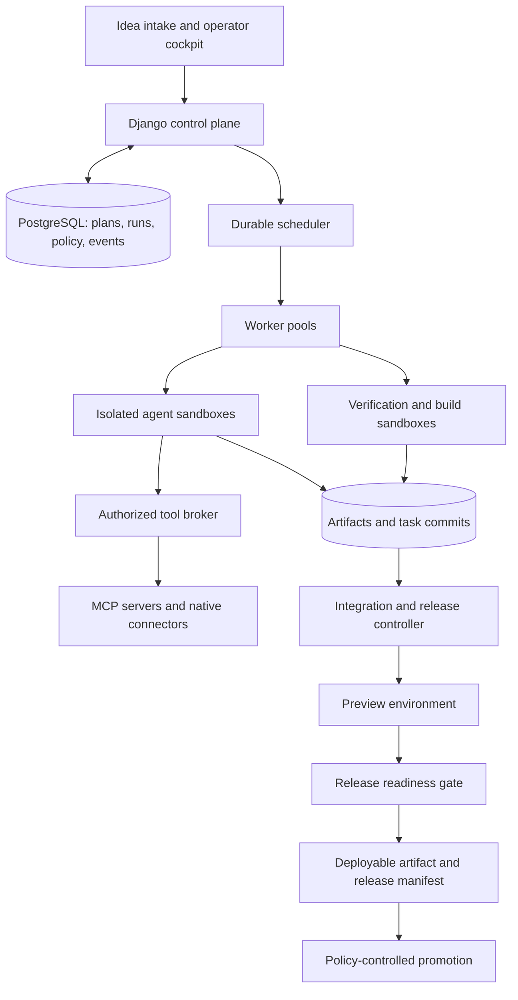

**Tempo: plan for a reliable software factory**

Assessment date: 2026-09-06. Code baseline: `45b84bd`. This is a proposed implementation plan, not a description of capabilities already delivered.

Tempo has a useful execution foundation. The next product milestone should be: **turn a bounded product brief into an integrated application, with an immutable build, verified acceptance criteria, a working preview, and a deployment package.** Preserve the existing issue-to-PR workflow as a supported delivery mode while building this broader lifecycle.

Adding agent roles alone will not reach that milestone. The critical additions are enforceable work contracts, isolated concurrent execution, reliable integration, trustworthy verification, and release evidence.

**1. Scope and evidence**

This assessment covers the configuration and workflow loaders, orchestration, runtime adapters, persistence and models, GitHub integration, workspace and validation execution, web authentication and control APIs, dashboard client code, migrations, deployment files, documentation, and deterministic tests. No live GitHub mutation, paid model run, or deployment was performed. Distributed-worker and infrastructure failure scenarios below are code-derived risks requiring targeted reproduction, not claims of observed production incidents.

Checks run against the existing checkout:

| Check | Result |
| --- | --- |
| `.venv/bin/ruff check .` | Passed |
| `.venv/bin/pytest -q` | 93 passed in 6.41 seconds |
| `.venv/bin/python manage.py check` | No issues |
| `.venv/bin/python manage.py makemigrations --check --dry-run` | No changes detected |

These establish a healthy deterministic baseline. They do not establish production isolation, live protocol compatibility, PostgreSQL failover correctness, browser usability, or generated-product quality. No tracked GitHub Actions workflow was found.

Assumed first market: a private, single-organization installation building small web applications and services in GitHub repositories, with one supported deployment target and a limited catalog of approved technology stacks. Support both existing repositories and new projects from maintained templates. Expand into arbitrary stacks, public multitenancy, mobile distribution, and complex multi-repository products after this path is reliable.

“Ready for deployment” means all release gates have passed for a named environment and immutable artifact. Production promotion can subsequently be automatic or operator-triggered according to project policy; deployment readiness must not depend on an agent's self-assessment.

**2. What to retain and what to correct**

Keep Django, PostgreSQL, the workflow configuration validation, project/environment records, run and node histories, retries, operator controls, and Codex App Server integration. These are useful assets. Keep the host-controlled publication boundary and the principle that final verification must match the published code.

The implementation is ahead of parts of its documentation. `ProviderRegistry` already supports Codex and an external JSONL bridge; the graph executor supports agent, human-gate, and join nodes. Conversely, registered provider names and configurable specialist prompts do not establish full runtime parity or safe collaboration. The default `WORKFLOW.md` still runs one implementation graph node, followed by a special review path outside the graph.

| Area | Existing implementation | Gap to close |
| --- | --- | --- |
| Intake | GitHub issue polling and labels | Product briefs, requirements, decisions, milestones, and acceptance criteria |
| Execution | Durable runs, leases, retries, node state | Fenced ownership, atomic transitions, independent workers, complete side-effect reconciliation |
| Agent teams | Configurable profiles and bounded DAG execution | Isolated writable workspaces, contracts, task dependencies, integration ownership |
| Handoffs | Node output JSON containing session metadata and a short message summary | Schema-validated deliverables with immutable artifact references and provenance |
| Tools | Host-provided GitHub and validation tools | A general authorization and execution broker with MCP adapters |
| Skills | Role prompts and whatever the runtime environment happens to provide | Pinned, tested, explicitly assigned skill packages |
| Verification | Agent-supplied commands, output capture, workspace fingerprint | Required checks owned by policy, exact source/build identity, acceptance coverage |
| Review | Separate Codex review thread with possible fixes | Runtime-neutral review nodes and decisions bound to the final commit |
| Delivery | PR, merge, no-change completion, human handoff | Build artifact, preview, environment checks, release manifest, rollback plan |
| Operations | Dashboard, SSE, token totals, audited interventions | Project authorization, correlated traces, cost controls, actionable release views |

**3. Highest-priority findings in the current code**

These should become a small, explicit hardening backlog before increasing write concurrency or connector authority.

| Priority | Code evidence | Consequence and required change |
| --- | --- | --- |
| P0 | `tempo/persistence.py:901`: heartbeat accepts only a run ID and reads the current lease token from the database | A previous worker is not required to prove ownership before extending the new owner's lease. Pass the worker's lease token/epoch through every write, heartbeat, tool authorization, and completion. Reject stale owners and stop their sandboxes. |
| P0 | `tempo/trackers/github.py:404`: merge body contains `merge_method`, without an expected head SHA | A changed PR head is not explicitly bound to the reviewed commit. Persist source/tree identity with validation and review, recheck remotely, and pass the reviewed SHA to merge. |
| P0 | `tempo/trackers/github.py:213`: generic repository-scoped REST mutations become available after an issue-level publication flag | Validation does not constrain all API payloads to validated content or a run-owned branch. Replace broad mutation authority with typed publish operations, branch restrictions, payload validation, and operation-specific policy. Keep read access scoped too. |
| P0 | `tempo/orchestrator.py:699` and `:1013`: parallel nodes receive the same `workspace_path` | Writers can change each other's checkout, Git index, dependencies, and validation inputs. Use a separate worktree/clone and sandbox for each writable task attempt, followed by serialized integration. |
| P0 | `tempo/config.py:424` resolves secrets; `tempo/persistence.py:123` persists the full effective configuration | Resolved provider credentials enter workflow history. Persist credential references; resolve secrets at the execution boundary. Inventory and migrate existing records and establish rotation procedures. |
| P0 | `tempo/codex.py:93`, `compose.yaml`, `tempo/validation_server.py:17` | Agents are child processes of the control plane; filtering selected environment variables is incomplete isolation. Compose provides shared workspace volumes and access to a privileged, unauthenticated Docker daemon; validation RPC has no caller authorization. Move workloads into separately authenticated, restricted execution infrastructure. |
| P1 | `tempo/persistence.py:922`: checkpoint sequence uses `count() + 1` before creation | Concurrent producers can allocate the same sequence. Allocate sequence numbers and update run state atomically; handle duplicate operation IDs explicitly. Prove with PostgreSQL concurrency tests. |
| P1 | `tempo/orchestrator.py:504`: work starts from `self.store.current()`; node definitions use the store's active workflow version | A run's stored workflow reference alone does not ensure retries execute its original definition. Load an immutable run snapshot for execution; apply edited workflows to new runs unless an explicit migration occurs. |
| P1 | `tempo/validation.py:159`: the caller supplies the entire command sequence | Successful exit codes cannot establish that required behavior was tested. Add a trusted validation profile and acceptance-test inventory; agents may propose extra checks but cannot remove mandatory checks. |
| P1 | `tempo/codex.py:484`: no-change completion checks a reason and validation fingerprint | An unchanged fingerprint since validation does not prove no implementation delta against the task's base. Require a base-relative diff check and requirement evidence for no-change completion. |
| P1 | `tempo/orchestrator.py:1142` and `tempo/config.py:232` | A completed turn and a 4,000-character summary can count as a successful handoff. Introduce output schemas and authoritative deliverable validation. |
| P1 | `tempo/orchestrator.py:1258` directly creates `CodexAppServer` for review | Review bypasses the provider registry and graph-level role configuration. Bring review into the same node/runtime/tool contract as other agents. |
| P1 | `tempo/agent_runtime.py:329` forwards unsolicited JSONL messages as events | The bridge has no general request/response tool broker dispatch or capability contract. Test actual tool calls, cancellation, approval, usage, and resumption before advertising another production runtime. |
| P1 | `tempo_web/views.py:51` and `:93`; `tempo_web/settings.py` | State/configuration reads are unauthenticated, and authentication lacks project-scoped authorization. Protect operational reads and apply authorization to all queries and actions. Fail startup for unsafe production secrets/settings. |
| P1 | `Dockerfile:2`; `WORKFLOW.md` sandbox settings and README deployment prose | Codex installs without a pinned version, and deployment documentation contains conflicting sandbox descriptions. Pin the runtime/image, record the actual effective policy, and verify it with isolation probes. |

GitHub supports an expected `sha` on its merge operation and returns a conflict when it differs. That makes commit-bound merge authorization a concrete incremental fix. [GitHub merge API](https://docs.github.com/en/rest/pulls/pulls#merge-a-pull-request)

**4. Target architecture and ownership**

Keep a modular application, with distinct execution processes. Extract clear interfaces from the 2,113-line orchestrator before multiplying service boundaries.



The scheduler owns dependency readiness, retries, budgets, and durable state. Agents propose plans, produce code and documents, and diagnose failures. The tool broker owns external action authorization. The integration controller owns shared branch changes. The release controller evaluates machine-verifiable gates and records deployment identity. None of these authorities should be delegated merely by writing an instruction in an agent prompt.

Initial extraction boundaries:

| Proposed module | Responsibility |
| --- | --- |
| `tempo/engine/` | Graph compilation, scheduling, transitions, retries, signals, budget reservations |
| `tempo/workers/` | Claims, fenced leases, sandbox lifecycle, cancellation, heartbeats |
| `tempo/runtimes/` | Codex adapter, external adapter, normalized events and capability declarations |
| `tempo/contracts/` | Brief, task, result, finding, evidence, and release schemas |
| `tempo/artifacts/` | Content-addressed storage, provenance, access control, retention |
| `tempo/tools/` | Authorization broker, native connectors, MCP clients, credential resolution |
| `tempo/skills/` | Package validation, resolution, installation, compatibility, evaluation |
| `tempo/integration/` | Task branches, commit acceptance, integration queue, conflict handling |
| `tempo/releases/` | Build, preview, readiness evaluation, promotion, rollback records |

Retain the current PostgreSQL execution engine for the first bounded delivery slice, after fixing its ownership and transaction invariants. Reassess a durable workflow engine when long waits, child workflows, and distributed recovery dominate maintenance. Temporal is a candidate because it resumes through recorded event history and replay, but adopting it requires a deliberate migration: deterministic workflow logic, external operations in activities, and one authoritative execution history. Do not maintain two competing schedulers. [Temporal workflow execution](https://docs.temporal.io/workflow-execution)

**5. The idea-to-release workflow**

| Stage | Primary producer | Required output and gate |
| --- | --- | --- |
| Intake | Product analyst | Versioned brief: user, problem, scope, exclusions, constraints, budget, target environment, unresolved questions |
| Discovery | Repository analyst | Existing architecture, instruction hierarchy, dependency/toolchain inventory, baseline tests, deployment assumptions; or approved template selection for a new repository |
| Specification | Product analyst and architect | Numbered acceptance criteria, user journeys, API/data contracts, nonfunctional requirements, architecture decisions, and identified risks |
| Planning | Planner | Work packages with dependencies, ownership boundaries, budgets, and acceptance checks; compiler rejects incomplete or cyclic dependencies |
| Implementation | Selected coding specialists | Isolated commits, focused tests, structured results, and evidence for assigned criteria |
| Integration | Integration controller and optional conflict-resolution agent | Combined commit built from accepted task commits; integration checks pass |
| Verification | Test runner and independent QA agent | Required tests, end-to-end journeys, migration checks, and evidence against the integrated commit |
| Review | Independent reviewer; security specialist when relevant | Structured findings with severity, location, reproduction, disposition, and exact reviewed SHA |
| Repair | Assigned implementer | Bounded corrective change; new commit invalidates affected evidence and review decisions |
| Packaging | Build controller | Immutable artifact, dependency inventory, provenance, environment configuration schema, migration and rollback instructions |
| Preview | Release controller and QA | Deploy the artifact into an ephemeral environment; record health, browser/API smoke results, URL, logs, and cleanup deadline |
| Readiness | Policy evaluator | Complete release manifest and satisfied gates, or explicit blocked criteria |

Ask the operator only for decisions that materially alter scope, architecture, spend, or authority. Record routine assumptions and let the run continue within its approved envelope. A durable question should retain context and support later answers without leaving a model turn or sandbox running indefinitely.

For new repositories, provision through a controlled bootstrap operation: select a versioned template, establish CI and repository protections, create the base commit, inventory the environment, and validate a minimal application before feature fan-out. For existing repositories, capture baseline failures and require explicit disposition; a pre-existing failure is not silently treated as a passed gate.

Requirements changes create a new brief/plan revision. Compute affected tasks and evidence, preserve unaffected results, and replan the unfinished work. Do not change the meaning of a running task through mutable prompt text.

The initial graph can remain acyclic. Model repair as bounded new task attempts or versioned child plans, not unrestricted back-edges. Add deterministic tool/test/build nodes, typed conditions, and durable waits before a visual workflow builder. Schedule each ready node when capacity becomes available; the current ready-node batches introduce unnecessary barriers. Define `all` and `any` join behavior explicitly, including skipped, cancelled, and failed dependencies.

**6. How multiple agents should collaborate**

Use a small, task-dependent team. A narrow bug fix may need an implementer and reviewer; a new application may use the roles below. Avoid paying for a fixed sequence of specialists when their deliverables are unnecessary.

| Role | Assignment | Typical authority |
| --- | --- | --- |
| Product analyst | Clarify behavior and acceptance criteria | Read project knowledge; write specification artifacts |
| Architect/planner | Define contracts and independent work packages | Read repository; propose architecture and plans |
| Implementer | Deliver a bounded change | Write its own sandbox; run local checks; submit a commit |
| UI specialist | Implement user journeys and interaction states | Assigned frontend code; browser in isolated preview |
| QA specialist | Challenge acceptance coverage and exercise the product | Read candidate; author tests in a separate branch; inspect preview |
| Reviewer | Identify correctness and maintainability findings | Read candidate and evidence; publish structured findings |
| Security specialist | Review changes involving relevant trust boundaries | Read candidate and scoped scanner results |
| Integration/release engineer | Diagnose conflicts or packaging failures | A narrowly scoped repair assignment; controllers retain publication authority |

All writable task attempts get unique branches and execution sandboxes. Git worktrees provide checkout separation, not a security boundary; mount only the needed checkout in each sandbox. Use a namespaced path such as `organization/project/run/task/attempt`, and do not depend on operators choosing disjoint roots.

Each assignment includes the exact base SHA, task contract, read/write scope, accepted prerequisite artifacts, relevant repository guidance, selected skill versions, validation requirements, budget, and escalation rules. Enforce writable boundaries where feasible and reject unexplained changes outside scope at integration.

Parallelize by cohesive deliverables with explicit interfaces. For example, agree on an API schema first, then implement the client and server independently against that schema. Schema changes, migration ordering, lockfiles, and shared configuration often require serialization.

Return structured artifacts, not the full conversation of every other agent. The integration queue accepts task commits only when their prerequisites still hold, combines them on a candidate branch, and validates the combined result. Conflicts become bounded integration tasks with an owner and evidence. A successful task does not imply a successful integrated product.

Reviewers should normally report findings without editing their reviewed checkout. If a reviewer produces a fix, treat it as a new contribution and obtain fresh independent review of the resulting candidate. Another model can be useful for review diversity, but independent inputs, permissions, and evidence matter more than model branding.

Nested runtime subagents may be permitted for bounded subtasks, but their usage and tool authority must remain attributable to the owning task. Tempo remains the owner of product-level dependencies, completion, and budgets.

**7. Contracts, artifacts, and durable data**

Introduce these records incrementally rather than replacing all existing run tables:

| Record | Essential fields |
| --- | --- |
| `ProductBrief` / revision | Goal, users, scope, exclusions, constraints, target, assumptions, decision history |
| `Requirement` | Stable criterion ID, observable expected behavior, priority, verification method |
| `ExecutionPlan` / revision | Brief revision, contract versions, task DAG, architecture decisions, budget |
| `WorkPackage` | Role, base SHA, dependencies, affected areas, criteria, input/output schema, limits |
| `TaskAttempt` | Parent run/node, immutable execution snapshot, lease epoch, sandbox, model/runtime, status |
| `Artifact` | Kind, schema version, digest, storage URI, producing attempt, source SHA, classification |
| `Evidence` | Criterion/check ID, candidate SHA or artifact digest, trusted verifier identity, result, logs |
| `ToolInvocation` | Operation ID, caller, capability, argument hash, authorization, external receipt, reconciliation status |
| `ReviewFinding` | Candidate SHA, severity, affected location, reproduction, status, resolution evidence |
| `ReleaseCandidate` | Source SHA, artifact digest, evidence set, configuration contract, readiness state |
| `Deployment` | Release candidate, environment, operation ID, external deployment ID, health, rollback target |
| `SkillVersion` / `CapabilityBinding` | Pinned package/schema, provenance, compatibility, permissions, tests |

Make attempt/session history one-to-many. `AgentSession` is currently one-to-one with a run, while `RunNode` carries much of the actual multi-agent history. Preserve those records during migration and stop overwriting the identity of previous attempts.

An illustrative result contract—not current supported configuration—could be:

```json
{
  "schema_version": "1",
  "task_id": "booking-api",
  "status": "completed",
  "base_sha": "<base>",
  "commit_sha": "<contribution>",
  "criteria": ["AC-3", "AC-4"],
  "artifact_ids": ["api-contract-v1", "test-report-17"],
  "unresolved_findings": [],
  "handoff": "Booking creation is implemented against the accepted API contract."
}
```

Validate structure and semantics: the commit must exist, the referenced artifacts must belong to the authorized project, prerequisite revisions must match, and criterion evidence must come from accepted verification. An agent-generated `status: completed` requests evaluation; it does not set authoritative task success.

Store large logs, screenshots, reports, and packages in object storage; store digests, relationships, and indexed summaries in PostgreSQL. Build context from artifact references, repository search, and decision records first. Add semantic retrieval when measured retrieval failures justify it. Curated project knowledge should retain provenance and should not automatically promote unreviewed agent assertions into trusted instructions.

**8. Tools, MCP, skills, and runtime support**

Treat these as separate layers: a runtime executes an agent; a model supplies inference; a tool performs an operation; MCP connects external tools/context; a skill packages reusable procedure and supporting assets; policy determines which operations are permitted. Tool descriptions and skill instructions are not enforcement mechanisms.

Build a broker around a typed `ToolInvocation` contract. Every call carries project/run/task identity, a current lease, capability binding, deadline, and operation ID. Validate arguments, authorize the target, apply resource limits, execute through a connector, redact output, and persist the result or an uncertain-outcome state. Retry reads and demonstrably idempotent operations; reconcile ambiguous writes before retrying them.

Start with a deliberately small capability catalog:

| Capability | Initial implementation |
| --- | --- |
| Repository reading and task-branch publication | Existing GitHub adapter refactored into constrained read/publish operations |
| Repository-native tests and builds | Deterministic worker activities using versioned validation profiles |
| Browser verification | Browser runner restricted to the task's preview and allowed resources |
| Documentation retrieval | Approved documentation connectors with source attribution |
| Preview and release status | One CI/deployment adapter selected for the initial supported stack |
| Design/context sources | Add only when a supported workflow consumes their outputs |

Implement MCP adapters for approved stdio servers and remote Streamable HTTP servers, including supported-version discovery, tools/resources/prompts, credentials, deadlines, cancellation, and schema compatibility checks. MCP defines context and operation exchange; it does not supply Tempo's workflow state or authorization model. Pin the protocol/SDK combination and verify connector conformance instead of assuming all servers expose the same capabilities. [MCP architecture](https://modelcontextprotocol.io/docs/learn/architecture)

Route privileged MCP actions through the same broker as native actions. Disable ungoverned runtime connector inheritance. Restrict server endpoints and egress, isolate local MCP subprocesses, and treat returned text as external data. A newly available server tool should require an updated approved binding before agents can call it.

Create a skill catalog with immutable versions, hashes, owners, supported stacks/runtimes, tool dependencies, expected outputs, and regression fixtures. Begin with requirements decomposition, repository reconnaissance, API implementation, UI implementation, migration review, test design, security review, and release preparation. Install only selected packages into a task's environment. Pin transitive scripts/assets and record the resolved skill set in the execution snapshot.

The Codex adapter can use App Server skill discovery and explicit skill input items rather than relying on an incidental host configuration. Official documentation describes `skills/list` and skill items in `turn/start`. Implement against the pinned runtime's schema and test the actual injected inputs. [Codex App Server skills](https://learn.chatgpt.com/docs/app-server#skills)

Expand `AgentRuntime` around a conformance suite: start/resume, streamed events, tool requests/results, cancellation, durable waiting, structured completion, usage reporting, and classified errors. Capabilities must be explicit. Unsupported resume or structured-output support should trigger a planned fallback, never silent equivalence. Move review through this interface before adding more providers. Model routes must verify fallback capabilities and cost policy too; metadata alone cannot establish a hard spending ceiling.

**9. Durable execution and isolation guarantees**

Use at-least-once execution with deduplicated and reconciled side effects. A database transaction cannot make a remote provider call exactly once. Persist intent before invoking a provider, then persist the receipt; if the response is lost, query the provider using a stable identity before another attempt. Some providers cannot resolve ambiguity, so retain an explicit uncertain state and a supported intervention path.

Implement atomic state transitions with expected status/version and fenced lease ownership. Budget reservations, task claims, checkpoint sequencing, and operation intent must be transactionally consistent. Reject stale worker reports as well as stale actions. A task's sandbox credentials should expire when its lease is lost.

Separate web/control-plane processes from workers. Let the dashboard read durable projections and event streams rather than process-local orchestrator dictionaries. Distinguish liveness from readiness; the existing health handler only checks whether an orchestrator object exists. Readiness should include database connectivity and scheduler freshness, while provider outages should appear as degraded capability status.

Use ephemeral sandboxes with a minimal environment allowlist, isolated home and runtime state, read-only toolchain images, CPU/memory/disk/process/time limits, and controlled network access. Keep control-plane database credentials, signing keys, cloud production authority, and other projects' workspaces outside the sandbox. Treat `externalSandbox` as a statement that the infrastructure supplies isolation; verify that infrastructure directly.

Pause and approval waits should checkpoint and release compute where the runtime supports it. Cancellation must propagate to node tasks, agent subprocess trees, remote validation jobs, preview jobs, and pending broker operations. Reconcile operations that may already have committed externally. Add a sweeper for leaked sandboxes, volumes, previews, and expired credentials.

Snapshot the brief/plan, prompts, workflow, model selection, runtime binary/image, skill packages, tool schemas, validation profile, policy version, and relevant repository SHAs for every attempt. Exact model-output replay is not guaranteed; reproducible inputs and captured evidence are the objective. A resumed run continues under its pinned policy, with explicitly recorded exceptional migrations.

**10. Verification and deployment readiness**

Keep fast agent-selected checks for development. Add a separate authoritative verification path whose required commands, test discovery, and pass criteria are selected from the accepted project profile and requirement contract. Changes to tests, CI, validation configuration, or the profile itself require explicit review. Missing tests, skipped required tests, malformed reports, and unexpectedly empty suites must not count as passing.

Bind verification to the integrated source identity and build environment. The existing fingerprint is valuable for detecting local changes, but it excludes ignored files and Git metadata and does not identify a published commit or artifact. Clean verification sandboxes should build from a specified commit with pinned dependencies; generated outputs belong in the artifact store. Record file modes, submodules, and other source inputs where relevant.

Release readiness should be a computed predicate:

```text
accepted requirements covered
AND required checks pass for the candidate identity
AND independent review remains valid for that identity
AND no unresolved findings prohibited by project policy
AND immutable artifact built and its provenance recorded
AND configuration and migration requirements validated
AND the same artifact passes preview health and smoke checks
AND deployment and rollback instructions are complete
```

For a web application, required evidence normally includes unit/integration tests, key browser journeys, authentication/authorization cases, relevant accessibility checks, migration application against representative data, dependency/secret scanning, and performance checks tied to explicit requirements. Tailor the profile to the product; avoid mechanically applying every scanner to every task.

Build once and promote the artifact digest that passed verification. If merging changes the source identity, create a new candidate and rebuild/reverify it before readiness. Record build provenance and a dependency inventory; GitHub artifact attestations can bind a build to workflow/repository/commit context and associate an SBOM. Attestations establish provenance, not application correctness. [GitHub artifact attestations](https://docs.github.com/en/actions/concepts/security/artifact-attestations)

The release package should include artifact digest, source SHA, acceptance/evidence matrix, configuration schema and secret references, migration procedure, deployment instructions or infrastructure definition, health checks, observability defaults, rollback procedure, known limitations, and an owner. Rehearse application rollback and separately document data recovery; destructive data migrations may require a forward fix or restore rather than a reversible migration.

**11. Observability, economics, and evaluation**

Instrument the factory before comparing models or scaling concurrency. Correlate product, plan, run, node, attempt, session, sandbox, tool invocation, verification, artifact, and deployment IDs. Use structured traces and redacted event records; retain useful command output and decisions without exposing private model reasoning.

Track acceptance success, integration success, escaped defects, intervention rate, retries by cause, conflict frequency, queue time, active execution time, approval wait, preview lifetime, token/tool/compute cost, and cost per accepted release. Keep successful task count separate from successful release count.

Reserve budgets before dispatch. Account for parallel tasks, reviewers, nested subagents, retries, tools, and sandboxes. Preserve lifetime product/run caps even when a retry resets its local allowance. Use live provider rates or a versioned accounting table with explicit uncertainty; the current token ceiling is not a dollar ceiling. Limit failure amplification with shared retry, elapsed-time, and replan budgets.

Create an initial benchmark of roughly 20–30 bounded tasks across the supported templates: bug fixes, features, ambiguous briefs, cross-component changes, migrations, baseline test failures, and adversarial issue/tool content. Measure repeated runs because agent behavior varies. Use held-out criteria, deterministic checks, and human inspection of a sample; an evaluator agent's score is supplementary evidence.

Required fault fixtures include process death at every external-action boundary, stale worker recovery, lost publish responses, duplicate events, provider quota exhaustion, connector schema changes, malformed model output, branch movement after review, dependency drift, concurrent conflicting edits, and preview cleanup failure. Run database races against PostgreSQL with distinct processes; SQLite and mocks cannot prove those guarantees.

Promote workflow/model/skill/tool revisions only after regression evaluation. Start with shadow or preview-only runs, then expand authority by project and measured reliability. Pin the previous working revision and make rollback an operator action.

**12. Implementation sequence and acceptance gates**

The effort ranges below are engineering estimates, not observed delivery rates. They include implementation and focused verification but exclude unpredictable provider, infrastructure, and deployment-target setup. With two experienced engineers, allow roughly a quarter for a useful pilot and additional time for broad production hardening; revise estimates after the first two phases.

| Phase | Proposed effort | Concrete deliverables | Exit gate |
| --- | --- | --- | --- |
| 0. Establish safety and baseline | 2–3 engineer-weeks | Commit-bound review/merge; constrained publication; initial trusted validation profile; lease fencing; atomic checkpoints; secret references; protected reads; pinned runtime; CI; accurate sandbox documentation and probes | Stale owner and changed-head tests fail closed; mandatory checks cannot be bypassed through supported APIs; no resolved credentials in new snapshots |
| 1. Contracts and product intake | 2–3 engineer-weeks | Brief/requirement/plan/result schemas; artifacts; immutable run snapshots; task-based run abstraction with legacy issue adapter; template onboarding | A brief compiles into an auditable task plan; malformed outputs are rejected; retries retain original contracts |
| 2. Isolated agent collaboration | 3–4 engineer-weeks | Per-task sandbox/worktree; integration queue; runtime-neutral review; bounded repair; authoritative integrated checks | Three tasks execute concurrently, including a deliberate overlap; conflicts are resolved explicitly; only the integrated candidate advances |
| 3. End-to-end release slice | 3–4 engineer-weeks | One supported stack and deployment target; build artifact; preview; acceptance matrix; release manifest; readiness evaluator; rollback rehearsal | A fresh brief produces a working application and independently verified deployable artifact without manual code editing |
| 4. Managed capabilities | 2–3 engineer-weeks | Tool broker completion; approved stdio/HTTP MCP adapters; skill registry; runtime conformance suite; role-specific bindings | A selected skill and MCP capability work end to end, are attributable and scoped, and fail safely on schema/auth changes |
| 5. Distributed production operation | 3–5 engineer-weeks | Independent workers; durable read projections; distributed cancellation; full resource isolation; project roles; backup/restore; traces and lifetime budgets | Kill and partition workers under PostgreSQL load: no accepted work disappears, stale actions are rejected, ambiguous side effects reconcile |
| 6. Evaluation and product usability | 2–4 engineer-weeks | Benchmark/reporting; revision promotion; guided onboarding; run graph; diffs/artifacts; release and blocker views | A second repository is onboarded through the product; revisions are compared on quality/cost; operators diagnose failures from the UI |

Some work overlaps, but dependencies matter: establish ownership before scaling workers, isolated workspaces before concurrent writers, constrained capability execution before MCP writes, and evidence identities before release promotion. Add minimal isolation, traces, and evaluation fixtures in early phases; Phase 5 expands and proves them at distributed scale.

The first useful milestone is Phase 3. It proves the factory's product outcome. Connector breadth, additional runtimes, and a visual workflow editor should earn priority by improving that outcome.

**13. First ten implementation tickets**

1. **Bind review and merge to an exact candidate.** Add reviewed SHA/tree/evidence IDs; send expected SHA; invalidate review on branch movement; test a changed head and a lost merge response.
2. **Constrain publication and completion.** Publish only accepted commits to run-owned branches; deny other ref writes; separate comment/PR operations; verify no-change against the task base.
3. **Fence persistence and effects.** Require the claiming lease on heartbeat, node completion, checkpoint, and tool calls; allocate sequences atomically; prove old-worker rejection with PostgreSQL.
4. **Remove ambient authority.** Store secret references, build environment allowlists, isolate worker execution, authenticate validation jobs, and test that a task cannot reach another task or control-plane credentials.
5. **Freeze execution inputs.** Resolve a complete immutable run snapshot; resume from it; test workflow/skill/model configuration changes during an interrupted run.
6. **Add authoritative validation profiles and CI.** Define mandatory checks independently of agent text, validate test reports, and run existing checks plus PostgreSQL/protocol regression lanes in CI.
7. **Introduce artifacts and typed results.** Add schema validation, content digests, provenance, semantic commit checks, and structured blocked/failed/completed dispositions.
8. **Add product briefs and task compilation.** Preserve issue compatibility, introduce stable acceptance IDs, template bootstrap, dependency validation, and bounded scope-change handling.
9. **Isolate task contributions and integrate them.** Add task workspaces, commit handoff, a serialized integration queue, and a conflicting-edit fixture with fresh combined validation.
10. **Unify review and produce a release candidate.** Move review into the graph/runtime abstraction; add trusted build/preview activities and a computed readiness manifest for one stack.

Each ticket should preserve the existing issue workflow through compatibility tests. Use additive migrations, backfill historical identities where possible, and distinguish unknown legacy evidence from verified new evidence. Roll out the factory workflow per project behind an explicit configuration version.

**14. Demonstration and success criteria**

Use a compact demonstration brief such as a booking application with authentication, availability, reservation conflicts, and an operator view. Require the planner to define observable criteria before coding. Implement the API and UI in separate task sandboxes against an accepted interface, integrate them, exercise double-booking and authorization scenarios, and deploy the built artifact to preview.

Deliberately kill a worker, introduce an integration conflict, move the PR head after review, and make one preview health check fail. The system should recover or report an explicit blocker with evidence. It must not report deployment readiness in those failing states.

Proposed pilot targets, to calibrate after collecting baseline results:

| Measure | Initial target |
| --- | --- |
| Release evidence completeness | 100% of ready candidates have identity-bound required evidence |
| Fault-suite integrity | No lost accepted tasks or unauthorized duplicate effects in the defined fault fixtures |
| Isolation checks | All defined cross-task, credential, and stale-lease probes rejected |
| Bounded-task success | At least 80% of the initial supported benchmark reaches accepted readiness without manual code edits; report sample size and variance |
| Operator visibility | Every blocked run exposes its failed criterion, evidence, and permitted next action |
| Economics | Every run reports known model/tool/compute cost and remaining budget, with estimates labeled |
| Reproducibility | Every accepted release can be traced to its source, artifact, execution snapshot, and preview result |

Passing these fixtures is a bounded release criterion, not a claim of universal reliability. The strongest next investment is a complete, measurable path from brief to verified application, supported by the execution and authorization fixes above.
