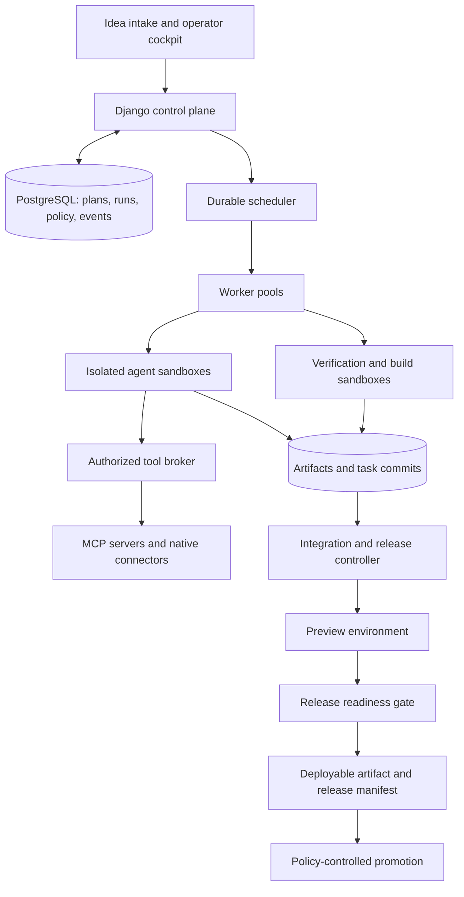

**Tempo: plan for a reliable software factory**

Updated: **2026-09-10**. Reviewed deployment baseline: **`fe26221`**.
The original assessment was made on 2026-09-06 at `45b84bd`; the plan was first committed as
`7f40f0f`. This document now records current delivery status and the remaining roadmap.
Historical findings and incremental progress notes remain available in Git history.

**End goal:** take an idea through requirements, planning, coordinated coding agents,
integration, independent verification, and packaging to an immutable software release that is
ready for a named deployment environment. Support both existing repositories and new applications,
with governed tools, skills, and MCP connections. Preserve the existing issue-to-PR workflow.

**Current assessment:** a functioning, supervised factory prototype for bounded enhancements
to an existing React application. The first live pilot reached local staging with operator
assistance. We have not yet demonstrated repeatable delivery without manual code repair,
new-application creation, or general public production deployment. A completion percentage would
suggest a level of measurement we do not have; the gates below define progress instead.

**Next milestone:** repeat the React mini-app enhancement path with no operator source edits,
using the factory's repair workflow if needed, and retain the full acceptance and release evidence.
Brief, plan, repair, and release approvals may remain human decisions and must be reported as
interventions. Passing this milestone would establish supervised delivery without manual coding;
it would not establish unattended autonomous operation.

The next implementation slice adds opt-in version 2 task requirements and host-checked file and
decision deliverables; see [task contracts](TASK_CONTRACTS.md). The live pilot remains pending.
The user also requested first-class configuration of the agents underneath Tempo: multiple
Codex accounts, multiple Claude accounts, and explicit project/team assignments. This is now a
prioritized workstream in [agent accounts](AGENT_ACCOUNTS.md), beginning after the next pilot
alongside CI. Existing runtime definitions do not yet fulfill that account-management requirement.

**1. Current scope and evidence**

The user-selected first target is the **React mini-app**, built with `react-mini-app-v1` and
published through the named local static staging adapter. It is an existing application, not a
new repository. The supported path is:

```text
Versioned brief → approved task graph → isolated implementation agents
→ serialized integration → required checks → retained build ZIP
→ reviewed browser acceptance → preview health → reviewed staging target
→ rollback rehearsal → publication and verified health
```

The first live pilot, brief #1 / plan #2 / run #7, supplies the strongest end-to-end evidence:

- Five native agents ran; two implementers overlapped in separate repositories, followed by
  integration and verification.
- Agents implemented drawing advice and a resettable preparation checklist. The final candidate
  passed 27 application tests, two asset-preparation tests, production build checks, and two
  reviewed browser criteria, including the existing image-to-SVG flow.
- A retained build passed preview health and rollback rehearsal. It was published, rolled back,
  and republished to local staging. The current publication is release #2 of build #1.
- The run required a credential update, operator build-script repairs, and a temporary switch to
  its saved validation image. A planner profile also prohibited the file edit its task requested.
  It is an **assisted success**, not evidence that every task instruction was fulfilled.
- Reported usage was 1,489,526 model tokens, including input/context. This is not a dollar cost,
  and one pilot is not a measured factory success rate.

See [the pilot record](FIRST_AGENT_PILOT.md), [its machine-readable receipt](examples/mini-app-pilot-result.json),
and [the reviewed brief and task plan](examples/mini-app-pilot.json).
The [idea and evidence](http://localhost:8001/ideas/1/) and
[local staging application](http://5c96e222bd9e46cbb267bab9669934ad.localhost:8032/)
are accessible from the deployment host.

Subsequent reliability steps are delivered, with different levels of evidence:

| Change | Evidence and limit |
| --- | --- |
| Graph usage and replay timing (`e349cbc`) | Corrected graph-wide token reporting and preserved completed-task timestamps on replay; the pilot record identifies its original contribution checkpoints. |
| Reviewed agent repair (`03e7a01`) | Automated execution and PostgreSQL tests cover one scoped repair turn, clean commit/path enforcement, fresh checks, interrupted work, duplicate requests, and retained history. It has not yet completed a new live product-agent pilot. |
| Retained validation images (`fe26221`) | The deployed runner executed overlapping sandbox jobs on the new image and the pilot's original image, with exact result identities and isolation checks. This was a compatibility probe, not a new application delivery. |
| Latest feature verification | Full suite: 652 passed, 24 environment-dependent skips; focused image/snapshot/authentication checks: 62 passed, four Docker skips; all seven real Docker sandbox tests passed. These counts describe that change's validation, not universal reliability. |
| Deployment operation | Commit, push, backup, deployment, and live smoke checks completed; all eight services were healthy and the pilot's retained artifact/publication evidence remained valid. |

“Ready for deployment” means the required evidence passes for the exact artifact and named
environment. An agent's completion message, a successful coding turn, or a green run alone is
insufficient. Current readiness is scoped to local static staging; it does not certify a database
application, a cloud deployment, or arbitrary production infrastructure.

**2. Delivered capabilities and their boundaries**

| Area | Delivered | Remaining boundary or extension |
| --- | --- | --- |
| Intake and plans | Versioned briefs, stable criteria, typed tasks/dependencies, deterministic starter plans, exact-revision approval | Agent-led discovery/planning, task/profile compatibility, new-project templates, and controlled scope replanning |
| Agent teams | Configurable roles, bounded DAG execution, separate implementer checkouts and homes, serialized integration | General typed deliverable enforcement, runtime-neutral independent review, richer conflict repair, and broader concurrency benchmarks |
| Required checks and builds | Host-owned check policy, source/commit verification, immutable run snapshots, retained React build ZIPs and manifests | Broader stack profiles, structured report validation, dependency inventories/attestations, and automatic CI regression lanes |
| Repair and recovery | Lease-fenced writes, durable retries, explicit fresh restart for eligible issue runs, reviewed product repair with bounded requests | Live repair demonstration, automated diagnosis/repair decisions, explicit historical schema migrations, and lifetime product budgets |
| Execution isolation | Disposable runtime/hook/validation containers, scoped environments, restricted networks, resource limits, cleanup and stale-owner tests | Lease-bound broker credentials, disk quotas, stronger infrastructure separation, and hostile multitenant guarantees |
| Validation image compatibility | Concurrent use of approved immutable IDs collected from verified snapshots | Images must remain installed; archival, garbage collection, and revocation administration are not automatic |
| Acceptance and previews | Reviewed browser journeys, offline verification, retained evidence, expiring isolated previews, HTTP health checks | QA-agent check proposals, broader accessibility/security/performance profiles, and API/service acceptance |
| Release | Six-gate local readiness, reviewed targets, immutable bundles, publication history, rollback rehearsal and recovery | Public production targets, application services, runtime secrets/configuration, database migrations, and production monitoring |
| Tools and skills | Constrained native GitHub/validation operations and restricted product-agent tool access | General capability broker, governed MCP adapters, pinned skill packages, and runtime conformance |
| Operator experience | Clearer work/decision views, brief/plan setup, live build progress, repair controls, acceptance and release evidence | Guided second-repository onboarding, full accessibility/operator evaluation, large-history usability, and project roles |
| Economics and evaluation | Run/node token reporting, attempt limits, fault fixtures, one assisted live pilot | Dollar/compute/tool cost accounting, lifetime reservations, intervention metrics, repeated benchmarks, and measured revision promotion |

Installation-wide authentication, credential references, authenticated runner endpoints,
commit-bound GitHub review/merge, constrained publication, atomic checkpoints, and stale-worker
rejection are implemented. They should remain regression requirements, not be reopened as if
nothing had been delivered. A general external-effect broker and distributed production proof
are still broader than the operations already covered.

Implementation references: [product intake](PRODUCT_INTAKE.md), [product execution and repair](PRODUCT_EXECUTION.md),
[contribution integration](CONTRIBUTION_INTEGRATION.md), [run snapshots](RUN_SNAPSHOTS.md),
[publication](PUBLICATION.md), [credential boundaries](CREDENTIALS.md),
[runtime isolation](RUNTIME_ISOLATION.md), [network policy](EXECUTION_NETWORK.md),
[validation isolation and images](VALIDATION_SANDBOX.md), [static builds](STATIC_BUILDS.md),
[acceptance](ACCEPTANCE_CHECKS.md), [previews](PREVIEWS.md), [readiness](RELEASE_READINESS.md),
[staging publication](STAGING_PUBLICATION.md), and [access/deployment](ACCESS_AND_DEPLOYMENT.md).

**3. Gaps that currently limit the end goal**

These are the current gaps; the original line-numbered baseline findings are historical.

| Priority | Gap | Required proof or next change |
| --- | --- | --- |
| Next | Task/profile conflicts and weak completion semantics | Version 2 checks are implemented locally for declared write capabilities and required files/decisions. Enable and review them in the next pilot; prompt-prose inference and semantic deliverable verification remain outside this slice. |
| Next | No fresh live delivery using the new repair path | Complete a new approved mini-app enhancement without operator source edits; exercise a controlled build failure and retain the repair plus fresh checks. |
| Next | No repeated release-level evaluation | Record successes, failures, time, tokens, available costs, and each human intervention over repeated runs. Keep fixture pass rates separate from product delivery rates. |
| Near term | No tracked GitHub Actions workflow | Add lint, Django/migration, unit, PostgreSQL race, and appropriate isolated runner regression lanes; retain test evidence in CI. |
| Near term | No account-management flow or tested native Claude adapter | Add named provider accounts, scoped credentials/project grants, role bindings, isolated sessions, connection health and shared capacity. Prove multiple Codex accounts and a mixed Codex/Claude team; see [the account plan](AGENT_ACCOUNTS.md). |
| Near term | Existing-repository scope only | Add reviewed template bootstrap, repository/base identity, baseline checks, and a minimal new application before agent fan-out. |
| Near term | Managed capabilities incomplete | Implement the authorization broker, one scoped MCP integration, and one pinned skill package before expanding connector breadth. |
| Expansion | Local static release only | Add an explicitly selected public target, then a service/database stack with configuration, secret references, migration validation, health and recovery contracts. |
| Expansion | Distributed operation and cost controls incomplete | Separate worker/control lifecycles, prove crash/partition recovery, enforce project roles and lifetime budgets, and add image/artifact retention and restore drills. |

The operator repairs from the first pilot must stay in its historical record. New recovery code
and image probes resolve implementation gaps; they do not retroactively turn that pilot into an
autonomous result. Preserve the approved contracts and published artifact while testing successors.

**4. Target architecture and ownership**

Sections 4–11 describe the target architecture and operating requirements. They are not a list of completed capabilities; sections 1–3 and 12–14 record delivery status and remaining acceptance gates. Preserve the working implementation while extracting clear interfaces from the orchestrator before multiplying service boundaries.



The scheduler owns dependency readiness, retries, budgets, and durable state. Agents propose plans, produce code and documents, and diagnose failures. The tool broker owns external action authorization. The integration controller owns shared branch changes. The release controller evaluates machine-verifiable gates and records deployment identity. None of these authorities should be delegated merely by writing an instruction in an agent prompt.

Initial extraction boundaries:

| Proposed module | Responsibility |
| --- | --- |
| `tempo/engine/` | Graph compilation, scheduling, transitions, retries, signals, budget reservations |
| `tempo/workers/` | Claims, fenced leases, sandbox lifecycle, cancellation, heartbeats |
| `tempo/runtimes/` | Codex adapter, external adapter, normalized events and capability declarations |
| `tempo/contracts/` | Brief, task, result, finding, evidence, and release schemas |
| `tempo/artifacts/` | Content-addressed storage, provenance, access control, retention |
| `tempo/tools/` | Authorization broker, native connectors, MCP clients, credential resolution |
| `tempo/skills/` | Package validation, resolution, installation, compatibility, evaluation |
| `tempo/integration/` | Task branches, commit acceptance, integration queue, conflict handling |
| `tempo/releases/` | Build, preview, readiness evaluation, promotion, rollback records |

Retain the current PostgreSQL execution engine and its implemented ownership and transaction protections for the supported delivery slice. Reassess a durable workflow engine when long waits, child workflows, and distributed recovery dominate maintenance. Temporal is a candidate because it resumes through recorded event history and replay, but adopting it requires a deliberate migration: deterministic workflow logic, external operations in activities, and one authoritative execution history. Do not maintain two competing schedulers. [Temporal workflow execution](https://docs.temporal.io/workflow-execution)

**5. The idea-to-release workflow**

| Stage | Primary producer | Required output and gate |
| --- | --- | --- |
| Intake | Product analyst | Versioned brief: user, problem, scope, exclusions, constraints, budget, target environment, unresolved questions |
| Discovery | Repository analyst | Existing architecture, instruction hierarchy, dependency/toolchain inventory, baseline tests, deployment assumptions; or approved template selection for a new repository |
| Specification | Product analyst and architect | Numbered acceptance criteria, user journeys, API/data contracts, nonfunctional requirements, architecture decisions, and identified risks |
| Planning | Planner | Work packages with dependencies, ownership boundaries, budgets, and acceptance checks; compiler rejects incomplete or cyclic dependencies |
| Implementation | Selected coding specialists | Isolated commits, focused tests, structured results, and evidence for assigned criteria |
| Integration | Integration controller and optional conflict-resolution agent | Combined commit built from accepted task commits; integration checks pass |
| Verification | Test runner and independent QA agent | Required tests, end-to-end journeys, migration checks, and evidence against the integrated commit |
| Review | Independent reviewer; security specialist when relevant | Structured findings with severity, location, reproduction, disposition, and exact reviewed SHA |
| Repair | Assigned implementer | Bounded corrective change; new commit invalidates affected evidence and review decisions |
| Packaging | Build controller | Immutable artifact, dependency inventory, provenance, environment configuration schema, migration and rollback instructions |
| Preview | Release controller and QA | Deploy the artifact into an ephemeral environment; record health, browser/API smoke results, URL, logs, and cleanup deadline |
| Readiness | Policy evaluator | Complete release manifest and satisfied gates, or explicit blocked criteria |

Ask the operator only for decisions that materially alter scope, architecture, spend, or authority. Record routine assumptions and let the run continue within its approved envelope. A durable question should retain context and support later answers without leaving a model turn or sandbox running indefinitely.

For new repositories, provision through a controlled bootstrap operation: select a versioned template, establish CI and repository protections, create the base commit, inventory the environment, and validate a minimal application before feature fan-out. For existing repositories, capture baseline failures and require explicit disposition; a pre-existing failure is not silently treated as a passed gate.

Requirements changes create a new brief/plan revision. Compute affected tasks and evidence, preserve unaffected results, and replan the unfinished work. Do not change the meaning of a running task through mutable prompt text.

The initial graph can remain acyclic. Model repair as bounded new task attempts or versioned child plans, not unrestricted back-edges. Add deterministic tool/test/build nodes, typed conditions, and durable waits before a visual workflow builder. Schedule each ready node when capacity becomes available; the current ready-node batches introduce unnecessary barriers. Define `all` and `any` join behavior explicitly, including skipped, cancelled, and failed dependencies.

**6. How multiple agents should collaborate**

Use a small, task-dependent team. A narrow bug fix may need an implementer and reviewer; a new application may use the roles below. Avoid paying for a fixed sequence of specialists when their deliverables are unnecessary.

| Role | Assignment | Typical authority |
| --- | --- | --- |
| Product analyst | Clarify behavior and acceptance criteria | Read project knowledge; write specification artifacts |
| Architect/planner | Define contracts and independent work packages | Read repository; propose architecture and plans |
| Implementer | Deliver a bounded change | Write its own sandbox; run local checks; submit a commit |
| UI specialist | Implement user journeys and interaction states | Assigned frontend code; browser in isolated preview |
| QA specialist | Challenge acceptance coverage and exercise the product | Read candidate; author tests in a separate branch; inspect preview |
| Reviewer | Identify correctness and maintainability findings | Read candidate and evidence; publish structured findings |
| Security specialist | Review changes involving relevant trust boundaries | Read candidate and scoped scanner results |
| Integration/release engineer | Diagnose conflicts or packaging failures | A narrowly scoped repair assignment; controllers retain publication authority |

All writable task attempts get unique branches and execution sandboxes. Git worktrees provide checkout separation, not a security boundary; mount only the needed checkout in each sandbox. Use a namespaced path such as `organization/project/run/task/attempt`, and do not depend on operators choosing disjoint roots.

Each assignment includes the exact base SHA, task contract, read/write scope, accepted prerequisite artifacts, relevant repository guidance, selected skill versions, validation requirements, budget, and escalation rules. Enforce writable boundaries where feasible and reject unexplained changes outside scope at integration.

Parallelize by cohesive deliverables with explicit interfaces. For example, agree on an API schema first, then implement the client and server independently against that schema. Schema changes, migration ordering, lockfiles, and shared configuration often require serialization.

Return structured artifacts, not the full conversation of every other agent. The integration queue accepts task commits only when their prerequisites still hold, combines them on a candidate branch, and validates the combined result. Conflicts become bounded integration tasks with an owner and evidence. A successful task does not imply a successful integrated product.

Reviewers should normally report findings without editing their reviewed checkout. If a reviewer produces a fix, treat it as a new contribution and obtain fresh independent review of the resulting candidate. Another model can be useful for review diversity, but independent inputs, permissions, and evidence matter more than model branding.

Nested runtime subagents may be permitted for bounded subtasks, but their usage and tool authority must remain attributable to the owning task. Tempo remains the owner of product-level dependencies, completion, and budgets.

**7. Contracts, artifacts, and durable data**

The following is the target conceptual data model, not a promise that every name is a current Django model. Brief/plan revisions, run/node history, build artifacts, acceptance evidence, and deployment records already exist. Extend those records incrementally for the remaining contracts:

| Record | Essential fields |
| --- | --- |
| `ProductBrief` / revision | Goal, users, scope, exclusions, constraints, target, assumptions, decision history |
| `Requirement` | Stable criterion ID, observable expected behavior, priority, verification method |
| `ExecutionPlan` / revision | Brief revision, contract versions, task DAG, architecture decisions, budget |
| `WorkPackage` | Role, base SHA, dependencies, affected areas, criteria, input/output schema, limits |
| `TaskAttempt` | Parent run/node, immutable execution snapshot, lease epoch, sandbox, model/runtime, status |
| `Artifact` | Kind, schema version, digest, storage URI, producing attempt, source SHA, classification |
| `Evidence` | Criterion/check ID, candidate SHA or artifact digest, trusted verifier identity, result, logs |
| `ToolInvocation` | Operation ID, caller, capability, argument hash, authorization, external receipt, reconciliation status |
| `ReviewFinding` | Candidate SHA, severity, affected location, reproduction, status, resolution evidence |
| `ReleaseCandidate` | Source SHA, artifact digest, evidence set, configuration contract, readiness state |
| `Deployment` | Release candidate, environment, operation ID, external deployment ID, health, rollback target |
| `SkillVersion` / `CapabilityBinding` | Pinned package/schema, provenance, compatibility, permissions, tests |

Make attempt/session history one-to-many. `AgentSession` is currently one-to-one with a run, while `RunNode` carries much of the actual multi-agent history. Preserve those records during migration and stop overwriting the identity of previous attempts.

An illustrative result contract—not current supported configuration—could be:

```json
{
  "schema_version": "1",
  "task_id": "booking-api",
  "status": "completed",
  "base_sha": "<base>",
  "commit_sha": "<contribution>",
  "criteria": ["AC-3", "AC-4"],
  "artifact_ids": ["api-contract-v1", "test-report-17"],
  "unresolved_findings": [],
  "handoff": "Booking creation is implemented against the accepted API contract."
}
```

Validate structure and semantics: the commit must exist, the referenced artifacts must belong to the authorized project, prerequisite revisions must match, and criterion evidence must come from accepted verification. An agent-generated `status: completed` requests evaluation; it does not set authoritative task success.

Store large logs, screenshots, reports, and packages in object storage; store digests, relationships, and indexed summaries in PostgreSQL. Build context from artifact references, repository search, and decision records first. Add semantic retrieval when measured retrieval failures justify it. Curated project knowledge should retain provenance and should not automatically promote unreviewed agent assertions into trusted instructions.

**8. Tools, MCP, skills, and runtime support**

Treat these as separate layers: a runtime executes an agent; a model supplies inference; a tool performs an operation; MCP connects external tools/context; a skill packages reusable procedure and supporting assets; policy determines which operations are permitted. Tool descriptions and skill instructions are not enforcement mechanisms.

Build a broker around a typed `ToolInvocation` contract. Every call carries project/run/task identity, a current lease, capability binding, deadline, and operation ID. Validate arguments, authorize the target, apply resource limits, execute through a connector, redact output, and persist the result or an uncertain-outcome state. Retry reads and demonstrably idempotent operations; reconcile ambiguous writes before retrying them.

Start with a deliberately small capability catalog:

| Capability | Initial implementation |
| --- | --- |
| Repository reading and task-branch publication | Existing GitHub adapter refactored into constrained read/publish operations |
| Repository-native tests and builds | Deterministic worker activities using versioned validation profiles |
| Browser verification | Browser runner restricted to the task's preview and allowed resources |
| Documentation retrieval | Approved documentation connectors with source attribution |
| Preview and release status | One CI/deployment adapter selected for the initial supported stack |
| Design/context sources | Add only when a supported workflow consumes their outputs |

Implement MCP adapters for approved stdio servers and remote Streamable HTTP servers, including supported-version discovery, tools/resources/prompts, credentials, deadlines, cancellation, and schema compatibility checks. MCP defines context and operation exchange; it does not supply Tempo's workflow state or authorization model. Pin the protocol/SDK combination and verify connector conformance instead of assuming all servers expose the same capabilities. [MCP architecture](https://modelcontextprotocol.io/docs/learn/architecture)

Route privileged MCP actions through the same broker as native actions. Disable ungoverned runtime connector inheritance. Restrict server endpoints and egress, isolate local MCP subprocesses, and treat returned text as external data. A newly available server tool should require an updated approved binding before agents can call it.

Create a skill catalog with immutable versions, hashes, owners, supported stacks/runtimes, tool dependencies, expected outputs, and regression fixtures. Begin with requirements decomposition, repository reconnaissance, API implementation, UI implementation, migration review, test design, security review, and release preparation. Install only selected packages into a task's environment. Pin transitive scripts/assets and record the resolved skill set in the execution snapshot.

The Codex adapter can use App Server skill discovery and explicit skill input items rather than relying on an incidental host configuration. Official documentation describes `skills/list` and skill items in `turn/start`. Implement against the pinned runtime's schema and test the actual injected inputs. [Codex App Server skills](https://learn.chatgpt.com/docs/app-server#skills)

Expand `AgentRuntime` around a conformance suite: start/resume, streamed events, tool requests/results, cancellation, durable waiting, structured completion, usage reporting, and classified errors. Capabilities must be explicit. Unsupported resume or structured-output support should trigger a planned fallback, never silent equivalence. Move review through this interface before adding more providers. Model routes must verify fallback capabilities and cost policy too; metadata alone cannot establish a hard spending ceiling.

**9. Durable execution and isolation guarantees**

Use at-least-once execution with deduplicated and reconciled side effects. A database transaction cannot make a remote provider call exactly once. Persist intent before invoking a provider, then persist the receipt; if the response is lost, query the provider using a stable identity before another attempt. Some providers cannot resolve ambiguity, so retain an explicit uncertain state and a supported intervention path.

Implement atomic state transitions with expected status/version and fenced lease ownership. Budget reservations, task claims, checkpoint sequencing, and operation intent must be transactionally consistent. Reject stale worker reports as well as stale actions. A task's sandbox credentials should expire when its lease is lost.

Separate web/control-plane processes from workers. Let the dashboard read durable projections and event streams rather than process-local orchestrator dictionaries. Distinguish liveness from readiness; the minimal health endpoint does not establish complete distributed readiness. Readiness should include database connectivity and scheduler freshness, while provider outages should appear as degraded capability status.

Use ephemeral sandboxes with a minimal environment allowlist, isolated home and runtime state, read-only toolchain images, CPU/memory/disk/process/time limits, and controlled network access. Keep control-plane database credentials, signing keys, cloud production authority, and other projects' workspaces outside the sandbox. Treat `externalSandbox` as a statement that the infrastructure supplies isolation; verify that infrastructure directly.

Pause and approval waits should checkpoint and release compute where the runtime supports it. Cancellation must propagate to node tasks, agent subprocess trees, remote validation jobs, preview jobs, and pending broker operations. Reconcile operations that may already have committed externally. Add a sweeper for leaked sandboxes, volumes, previews, and expired credentials.

Snapshot the brief/plan, prompts, workflow, model selection, runtime binary/image, skill packages, tool schemas, validation profile, policy version, and relevant repository SHAs for every attempt. Exact model-output replay is not guaranteed; reproducible inputs and captured evidence are the objective. A resumed run continues under its pinned policy, with explicitly recorded exceptional migrations.

**10. Verification and deployment readiness**

Keep fast agent-selected checks for development. Add a separate authoritative verification path whose required commands, test discovery, and pass criteria are selected from the accepted project profile and requirement contract. Changes to tests, CI, validation configuration, or the profile itself require explicit review. Missing tests, skipped required tests, malformed reports, and unexpectedly empty suites must not count as passing.

Bind verification to the integrated source identity and build environment. The workspace fingerprint excludes ignored files and Git metadata. Current candidate and artifact records additionally bind source SHA, execution identity, required checks, and artifact digest; preserve those checks while broadening supported stacks. Clean verification sandboxes should build from a specified commit with pinned dependencies; generated outputs belong in the artifact store. Record file modes, submodules, and other source inputs where relevant.

Release readiness should be a computed predicate:

```text
accepted requirements covered
AND required checks pass for the candidate identity
AND independent review remains valid for that identity
AND no unresolved findings prohibited by project policy
AND immutable artifact built and its provenance recorded
AND configuration and migration requirements validated
AND the same artifact passes preview health and smoke checks
AND deployment and rollback instructions are complete
```

For a web application, required evidence normally includes unit/integration tests, key browser journeys, authentication/authorization cases, relevant accessibility checks, migration application against representative data, dependency/secret scanning, and performance checks tied to explicit requirements. Tailor the profile to the product; avoid mechanically applying every scanner to every task.

Build once and promote the artifact digest that passed verification. If merging changes the source identity, create a new candidate and rebuild/reverify it before readiness. Record build provenance and a dependency inventory; GitHub artifact attestations can bind a build to workflow/repository/commit context and associate an SBOM. Attestations establish provenance, not application correctness. [GitHub artifact attestations](https://docs.github.com/en/actions/concepts/security/artifact-attestations)

The release package should include artifact digest, source SHA, acceptance/evidence matrix, configuration schema and secret references, migration procedure, deployment instructions or infrastructure definition, health checks, observability defaults, rollback procedure, known limitations, and an owner. Rehearse application rollback and separately document data recovery; destructive data migrations may require a forward fix or restore rather than a reversible migration.

**11. Observability, economics, and evaluation**

Instrument the factory before comparing models or scaling concurrency. Correlate product, plan, run, node, attempt, session, sandbox, tool invocation, verification, artifact, and deployment IDs. Use structured traces and redacted event records; retain useful command output and decisions without exposing private model reasoning.

Track acceptance success, integration success, escaped defects, intervention rate, retries by cause, conflict frequency, queue time, active execution time, approval wait, preview lifetime, token/tool/compute cost, and cost per accepted release. Keep successful task count separate from successful release count.

Reserve budgets before dispatch. Account for parallel tasks, reviewers, nested subagents, retries, tools, and sandboxes. Preserve lifetime product/run caps even when a retry resets its local allowance. Use live provider rates or a versioned accounting table with explicit uncertainty; the current token ceiling is not a dollar ceiling. Limit failure amplification with shared retry, elapsed-time, and replan budgets.

Create an initial benchmark of roughly 20–30 bounded tasks across the supported templates: bug fixes, features, ambiguous briefs, cross-component changes, migrations, baseline test failures, and adversarial issue/tool content. Measure repeated runs because agent behavior varies. Use held-out criteria, deterministic checks, and human inspection of a sample; an evaluator agent's score is supplementary evidence.

Required fault fixtures include process death at every external-action boundary, stale worker recovery, lost publish responses, duplicate events, provider quota exhaustion, connector schema changes, malformed model output, branch movement after review, dependency drift, concurrent conflicting edits, and preview cleanup failure. Run database races against PostgreSQL with distinct processes; SQLite and mocks cannot prove those guarantees.

Promote workflow/model/skill/tool revisions only after regression evaluation. Start with shadow or preview-only runs, then expand authority by project and measured reliability. Pin the previous working revision and make rollback an operator action.

**12. Phase status and acceptance gates**

Delivery crossed phase boundaries to complete the selected mini-app path. A delivered slice does
not mean every original phase deliverable is complete. The original engineering-week estimates
are no longer a remaining-work forecast; re-estimate scoped tickets after the next live benchmark.

| Phase | Current status | Delivered portion | Remaining exit work |
| --- | --- | --- | --- |
| 0. Safety and baseline | Substantial foundation delivered | Commit-bound publication/review, required checks, leases/checkpoints, secret references, protected reads, runtime isolation, network and deployment probes | CI enforcement, remaining dependency/runtime pinning, and broader broker/operational guarantees; retain all existing fault checks |
| 1. Contracts and product intake | Existing-repository path delivered; phase partial | Brief/plan revisions, criteria, task compilation, approvals, immutable execution snapshots | Agent discovery/planning, task/result compatibility and evidence, template onboarding, and bounded scope-change handling |
| 2. Isolated collaboration | Implemented and partly demonstrated live | Two simultaneous implementers, serialized integration, host checks, reviewed repair | Live repair/conflict recovery, runtime-neutral review, typed handoffs, and the original three-task concurrency/overlap fixture |
| 3. End-to-end release | Assisted React-to-local-staging path demonstrated; exit gate not met | Retained build, independent browser evidence, preview, readiness, named target, publication, health and rollback | A fresh brief reaches verified release readiness without manual code edits; new-application bootstrap is a separate required demonstration |
| 4. Managed capabilities | Mostly remaining | Constrained native tools and runtime interfaces provide a foundation | Broker authorization, approved stdio/HTTP MCP adapters, skill registry, conformance tests, and attributable scoped use |
| 5. Distributed production operation | Partial safeguards delivered | Leases, isolation, backups, release recovery, retained-image routing, targeted PostgreSQL fault tests | Independent coding workers/projections, distributed cancellation/reconciliation, project roles, restore drills, quotas, lifetime budgets and production operations |
| 6. Evaluation and usability at scale | UI slices delivered; evaluation incomplete | Work/decision improvements, live progress, repair and delivery views, browser checks, pilot receipt | Repeated benchmarks, second-repository onboarding, accessibility/operator task studies, large-history behavior and evidence-based revision promotion |

Usability remains a workstream throughout these phases; see [the product experience plan](PRODUCT_EXPERIENCE.md).
Each new backend capability needs an understandable status, evidence, and next action. Remaining
UI work should be driven by the next pilot and a second operator's onboarding/failure-recovery
experience, rather than adding empty destinations or exposing implementation details by default.

Preserve the dependencies: ownership before more workers, isolated checkouts before concurrent
writers, governed capabilities before MCP writes, and exact evidence identities before promotion.
The next delivery gate is the no-manual-code-editing pilot, not completion of the entire roadmap.

**13. Prioritized remaining implementation tickets**

| Order | Ticket | Acceptance and evidence |
| --- | --- | --- |
| 1 | **Check plan/profile compatibility and required deliverables.** Opt-in version 2 contracts are implemented locally; enable and review them for the next pilot. | Explicit write requirements are checked against profile capabilities and runtime settings before model work. Required committed files and structured decisions gate task acceptance. Version 1 serialization stays unchanged. Live evidence remains pending; see [task contracts](TASK_CONTRACTS.md). |
| 2 | **Run a new supervised pilot without manual code edits.** Reuse the supported React target, freeze observable criteria, and include a recoverable build failure. | Native agents implement and repair the candidate; fresh required checks, browser evidence, preview, staging readiness, and rollback pass. Record every approval, environment intervention, and any operator edit; an edit makes this an assisted attempt. |
| 3 | **Measure repeated delivery and establish CI.** Start with a small repeated pilot set, then expand the 20–30-task benchmark. Add automatic regression lanes and a release-level result record. | Reports include denominators, failed attempts, interventions, duration, tokens, known costs/unknown costs, and evidence completeness. CI runs the defined fast and PostgreSQL checks; Docker/browser lanes run in suitable isolated infrastructure. |
| 3a | **Configure providers, accounts, and agent teams.** Deliver named Codex connections and project/profile assignment first, then a tested Claude adapter and shared account scheduling. | Two accounts of the same provider run without credential/session crossover; a mixed Codex/Claude team records actual task attribution. Revocation, reconnect, capacity and explicit fallback are tested. Secrets stay out of workflow JSON and snapshots. See [delivery slices](AGENT_ACCOUNTS.md). |
| 4 | **Strengthen planning, review, and handoffs.** Add repository-aware plan proposals, structured findings/results, independent runtime-neutral review, and explicit conflict-resolution assignments. | Missing deliverables and unresolved required findings block readiness. A three-task overlap/conflict fixture integrates only accepted work and obtains fresh verification. Runtime differences are tested rather than inferred from profile names. |
| 5 | **Bootstrap a new application.** Begin with a versioned React template and controlled repository creation, base commit, toolchain checks, CI, and configuration contract. | An idea creates a new repository and working application through the product flow, then passes the same artifact/acceptance/readiness gates without manual source edits. A second operator can complete onboarding. |
| 6 | **Deliver one governed skill and MCP capability.** Build the common authorization/effect contract, then pin and provision a selected skill and connector. | Calls are attributable to project/run/task and current authority; credentials stay scoped; schema/auth changes fail safely. Package/schema identities appear in new versioned snapshots without rewriting historical ones. |
| 7 | **Automate bounded recovery decisions.** Classify failures, propose repairs or scoped replans, and execute only within reviewed project authority and shared limits. | A defined recoverable failure completes without a new operator repair instruction; scope, authority, budget, and ambiguous external-effect failures stop with evidence. New commits receive fresh required evidence. |
| 8 | **Add public and service deployment support.** Select one public static target first; then add one application-service/database stack. | The reviewed artifact deploys with validated configuration/secret references, health/monitoring, cleanup, rollback, and data-recovery procedures. Service/database readiness is demonstrated independently of static staging. |
| 9 | **Complete distributed and economic controls.** Add independent coding workers, durable projections, project roles, lifetime reservations, retention/revocation, and restore operations. | PostgreSQL load and worker-kill/partition drills preserve accepted work and reject stale actions. Known costs and remaining budgets are visible; unknown costs are explicit. Backup restore and image/artifact availability are rehearsed. |
| 10 | **Evaluate and improve operation at scale.** Compare workflow/model/skill revisions and observe operators using onboarding, work, repair, and release views. | Operators diagnose the benchmark's blockers from the UI, keyboard/accessibility checks pass, a second repository works, and revisions are promoted using measured quality/cost/intervention results. |

Tickets 1–2 are the immediate sequence. Begin CI and measurement alongside them; do not defer
recording outcomes until the whole benchmark or distributed architecture exists. Later tickets
should be split into deployable slices with their own acceptance checks. Capability breadth and
additional stacks should follow evidence that the supported path works reliably.
Account configuration starts alongside ticket 3, before broad connector expansion; provider
authentication methods must be verified against pinned adapters before the UI promises support.

For every completed implementation slice, retain relevant regression evidence and follow the
requested **commit → push → deploy → live verification** workflow. Preserve issue-to-PR
compatibility, use explicit versioned contract changes and additive migrations, and never invent
missing historical evidence. A documentation update changes the roadmap, not a capability's
validation status.

**14. Demonstrations, evaluation, and completion criteria**

The first demonstration is complete **with assistance**. Keep its record as the baseline.
Advance through these demonstrations rather than substituting an unsupported larger application
for the selected first target:

1. **Existing React application, no operator source edits.** Use a fresh brief/plan, independent
   feature tasks, explicit criteria, and a controlled build failure. Complete any repair through
   Tempo, then retain checks, browser evidence, preview health, staging publication and rollback.
   Human approvals are allowed and counted; manual source edits or undocumented environment fixes
   must be reported and prevent an unassisted claim.
2. **Repeatability on the supported target.** Repeat bounded features and failures, including
   worker interruption and integration conflict. Freeze evaluation criteria, retain unsuccessful
   attempts, and compare accepted releases rather than completed agent turns.
3. **New application from an idea.** Bootstrap a maintained template into a new repository and
   reach the same independently verified release gate. This proves creation rather than enhancement.
4. **Broader deployment readiness.** Demonstrate one public environment, then a service/database
   application with authentication, migration, configuration, health, and data-recovery requirements.
   A booking application can be a later full-stack benchmark after that stack is supported.

The fault suite should also cover moved PR heads, provider/tool failures, lost external responses,
stale leases, and failed preview/release health. Recovery must produce valid new evidence or an
explicit blocker; none of these failures may be represented as deployment readiness.

| Measure | Target | Current evidence / remaining measurement |
| --- | --- | --- |
| Release evidence completeness | Every ready artifact has its required identity-bound evidence | Local staging gates and the pilot receipt are implemented; evaluate completeness across the repeated benchmark and each additional adapter |
| Fault integrity and isolation | All defined stale-owner, cross-task, credential, and duplicate-effect fixtures fail safely | Targeted PostgreSQL, Docker, network, and release recovery tests pass; distributed partition coverage and broader authority boundaries remain |
| Bounded-task success | Proposed target: at least 80% reach accepted readiness without manual code edits, with sample size and variance reported | One assisted live pilot; no measured unassisted success rate yet. Calibrate the target after initial repeated runs |
| Human intervention | Count approvals, clarifications, environment fixes, source edits, and repair decisions separately | Pilot interventions are documented; aggregate rates and automatic recovery performance remain unmeasured |
| Operator visibility | Every benchmark blocker exposes its reason, evidence, and permitted next action | Progress, failure, repair, acceptance, and release views exist; second-operator and accessibility evaluation remains |
| Economics | Known model/tool/compute costs and remaining lifetime budget, with uncertainty shown | Token totals and attempt limits exist; dollar/compute/tool attribution and lifetime budget enforcement remain |
| Traceability | Accepted releases link source, artifact, snapshots, verification, target and recovery evidence | Demonstrated for the local static pilot; skill/tool identities and additional application/deployment profiles remain |

The full end goal requires the new-application path, repeatable no-manual-code delivery, governed
capabilities, independent environment-specific release evidence, and operational/cost controls
for the supported product scope. It does not require every possible language, connector, or
hosting provider. Declare each supported stack and deployment target explicitly, and claim
completion only when its defined demonstrations and operating gates have passed.
